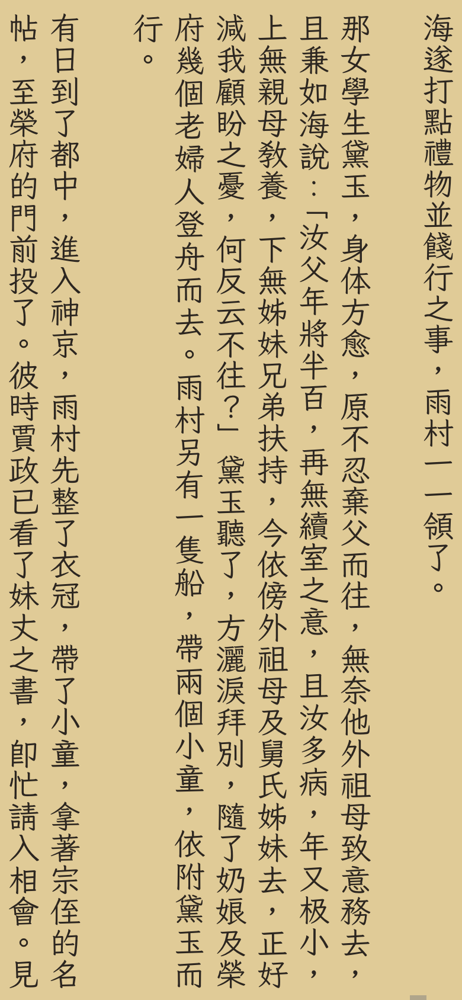
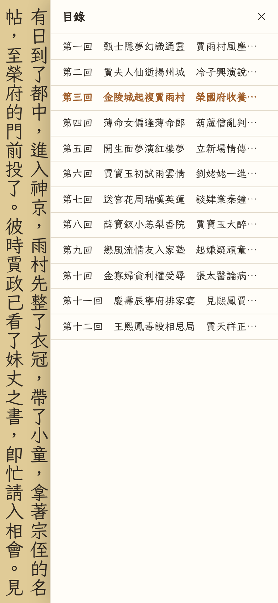
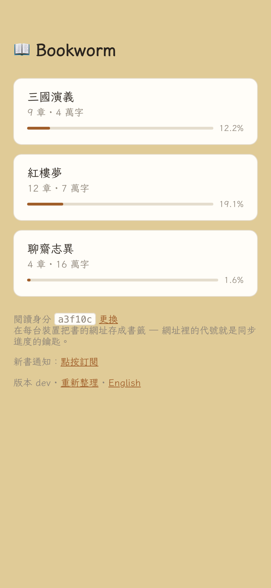
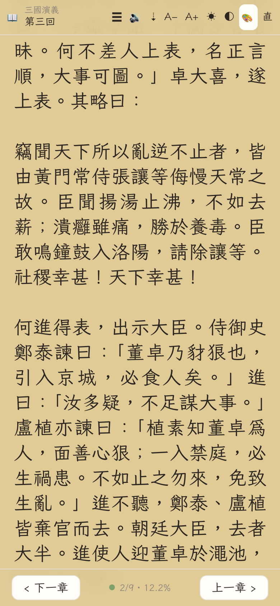

# Bookworm

**把你找到的中文長篇，變成真正為中文閱讀而生的私人 App。**

直排 · 簡轉繁 · 跨裝置接續 · 鎖屏朗讀 · 離線閱讀 · 自架零月費

繁體中文 · [English](README.en.md) · [安裝與維護](INSTALLATION.md)

大多數閱讀 App 先問你「這本書在哪個商店買的？」Bookworm 先問的是：**你想怎麼讀？**

把手上的 `.txt` 丟進去，Bookworm 會處理 GBK、Big5 等舊編碼，將簡體中文轉成台灣
繁體，辨認章節，再把它放進你自己的網址。之後手機、平板、電腦打開同一個連結，就能
從同一個字接著讀；想閉上眼睛時，按一下便從眼前這句接著唸。

它不是另一間書店，也不想接管你的藏書。它是一座只屬於你和幾位親友的中文閱讀伺服器。

> **一支 Cloudflare Worker，就是整套服務。** 沒有常駐主機、沒有 App Store、沒有
> 月費。在 Cloudflare 免費額度內，個人書架的實際運行成本是 `$0`。

  
  
  
  

直排整頁閱讀 · 目錄 · 私人書架 · 橫排模式 
畫面中的《紅樓夢》、《三國演義》、《聊齋志異》為公有領域作品，取自維基文庫。

## Bookworm 真正做得不一樣的地方

### 中文不是「也能顯示」，而是排版的起點

Bookworm 的直排不是把橫排轉九十度。每頁的行距、字級與頁寬都落在整數像素格線上，
頁面邊界永遠位於兩行之間；由右往左翻頁，不切半行，也不讓 iOS 的小數誤差一頁頁累積。

放大字體時，它調整的是每頁行數，畫面仍回到剛才那句；旋轉螢幕或切成橫排，閱讀位置
也不會消失。內附的 ENS Font 以霞鶩文楷 TC 為底，標點、行氣與 14 種紙色都為長時間
閱讀中文設計。

### 簡體來源，讀成自然的台灣繁體

Bookworm 不是只把 `软件` 的字形換掉，而是透過 OpenCC `cn→tw` 轉成「軟體」；
`信息` 也會成為「訊息」。內文、書名、章節標題、檔名與網址代稱一起轉，整座書架不會
半簡半繁。

轉換在切章前完成，因此章節辨識從一開始就面對一致的繁體內容。已經是繁體的來源可以
自動偵測或略過轉換；GBK、Big5、Shift_JIS 與 UTF-8 都能直接匯入。

### 位置記在「哪一個字」，不是哪一頁

一頁在 6 吋手機和 27 吋螢幕上長得完全不同，所以 Bookworm 不儲存頁碼，而是儲存
`章節 + 字元偏移`。換裝置、換字級、換直橫排，依然回到同一句。閱讀中定期同步，
關閉分頁前再補一次；離線時先留在本機，重新連線後自動補上。

不需要註冊帳號。管理者在 `/admin` 為每台裝置產生一把讀者鑰匙，把連結傳到裝置上
打開就完成登入；進度與設定跟著鑰匙對應的讀者代號，在每台裝置自動同步。

### 眼睛累了，故事不用停

按下 🔊，眼前的文字就成為有聲書。Bookworm 會把章節切成語音片段，在伺服器端合成
並快取；朗讀位置、畫面文字與書籤一起前進，播完自動進下一章。

在 Safari 與 iOS 上，片段會串成一條連續時間軸，鎖屏後仍可繼續播放，並支援系統鎖屏
控制。它不是另一份獨立音檔，而是從你正在看的那句無縫接手。

### 一個網址，就是書架，也是 App

讀到哪就存到哪：翻開一本書，鄰近章節自動留在這台裝置上，飛機上照樣讀；回到網路後，
進度自動同步。想在出門前先備好整本書，就在書架上按那本書的 ⇣。「加入主畫面」後得到
沒有瀏覽器外框的獨立 PWA — 無論從哪一頁安裝，入口都是書架，點進書就回到上次的位置。
新書上架時也能選擇接收 Web Push。

### 書是你的，服務也由你掌握

章節放在你的 Cloudflare R2，閱讀位置放在你的 D1，程式跑在你的 Worker。沒有第三方
閱讀帳號，也沒有封閉資料格式；原始 `.txt` 永遠留在你手上。`/admin` 一頁管完所有
需要密鑰的事：上傳、改書名、改網址代稱，或連章節、語音快取與閱讀位置一起刪掉。

Bookworm 沒有要你在家養一台 NAS。部署後沒有常駐程序、容器或作業系統需要維護；
Cloudflare 的免費方案目前包含 [Workers 每日 100,000 次請求](https://developers.cloudflare.com/workers/platform/limits/)、
[R2 每月 10 GB 儲存](https://developers.cloudflare.com/r2/pricing/)與
[D1 共 5 GB 儲存](https://developers.cloudflare.com/d1/platform/pricing/)，足以容納典型的私人長篇書架。

## 跟其他閱讀 App 放在一起看

這不是一張「誰的功能最多」的排行榜。每一款產品的設計中心不同；Bookworm 的位置，
是在商店型閱讀器與大型自架書庫之間，專心把**自己的中文純文字長篇**讀好。

| | **Bookworm** | **Kobo／Apple Books** | **Readwise Reader** | **Calibre-Web／Kavita** |
| --- | --- | --- | --- | --- |
| 最適合 | 自己收藏的中文長篇 `.txt` | 購買與閱讀商店電子書 | 文章、PDF、EPUB、標註與知識工作流 | 管理多格式、大型自架書庫 |
| 中文直排 | 核心設計；整頁格線、右至左翻頁 | 依書籍、格式與平台而定 | 不是產品核心 | 不是產品核心 |
| 匯入前處理 | 舊編碼、簡轉繁、辨識標題、自動切章 | 依平台支援格式匯入 | 可匯入 EPUB／PDF 等文件 | 格式、書目與轉檔能力最完整 |
| 跨裝置進度 | 自己的網址；精確到字元 | 由平台帳號與雲端同步 | 由 Readwise 帳號同步 | 由自己的伺服器與使用者系統負責 |
| 朗讀 | 從眼前文字接手、跨章、鎖屏連續播放 | Kobo Web Reader 僅部分書籍提供 | 多語 AI 語音，屬訂閱服務 | 依閱讀器或外部工具而定 |
| 主機與資料 | Cloudflare 代管基礎設施，資料在自己的帳戶 | 平台雲端 | Readwise 雲端 | 自己維護主機或容器 |
| 持續成本 | 個人用量通常為 `$0` | App 免費；書籍另購 | 月費訂閱 | 軟體免費；主機、儲存與維運自理 |

比較依據來自各產品的公開說明：
[Kobo Apps](https://www.kobo.com/tw/zh/p/apps)、
[Apple Books 同步](https://support.apple.com/zh-tw/guide/iphone/iphb886e1752/ios)、
[Readwise Reader](https://readwise.io/read/)、
[Calibre-Web](https://github.com/janeczku/calibre-web)、
[Kavita](https://www.kavitareader.com/)。功能與價格可能隨產品更新而改變。

## 適合你嗎？

如果你有這些習慣，Bookworm 很可能正是缺的那一塊：

- 手上有網路小說、古典文學或其他長篇 `.txt`，來源常是簡體或舊編碼。
- 在手機和平板讀中文時，真的在意直排、標點與每一頁是否完整。
- 想在通勤時讀、走路時聽，回家換電腦還能從同一句接下去。
- 想和幾位信任的親友共用私人書架，不想替每個人建立帳號。
- 喜歡掌握自己的資料，但不想維護一台 24 小時開機的伺服器。

Bookworm 目前**不適合**需要這些功能的人：

- 直接閱讀 EPUB、PDF、漫畫或 DRM 商店書籍。
- 畫線、註記、全文搜尋、辭典或知識管理。
- 公開營運，或精細的逐人／逐書權限（讀者鑰匙只分「能不能讀」，不分「能讀哪本」）。
- 多語語音；目前朗讀固定為台灣華語。

這些限制是刻意的取捨：Bookworm 不追求成為所有書的萬用書庫，而是成為中文長篇的
舒服閱讀入口。

## 從一個 `.txt` 到你的私人 App

上書不需要重新部署。開啟 `/admin`（書架頁尾的「管理」就指向它），選取 `.txt` 或
`.zip`，確認偵測到的章節並上傳；解壓縮、編碼轉換、簡轉繁和切章都在瀏覽器內完成，
手機也能操作。同一頁列出書架上每一本書，可以就地改書名、改代號或刪除 —— 每本書存
在一組固定的書號下，改代號只換網址：檔案不搬、閱讀進度不動，舊網址也還通得到。大型
檔案或批次工作則可交給 GitHub Actions 或 CLI。

部署本身約需 15 分鐘：fork 專案、設定三個 secret、執行一次 GitHub Actions。完整的
步驟、權限設定、上書方式、推播、自訂網域、本機開發與疑難排解都已移到
**[安裝與維護指南](INSTALLATION.md)**。

## 技術輪廓

- **Cloudflare Worker**：路由、API、TTS 與靜態前端。
- **R2**：純文字章節、manifest 與已合成的語音片段。
- **D1**：閱讀位置、同步設定與推播訂閱。
- **原生 JavaScript PWA**：沒有前端框架、bundler 或必要的建置步驟。
- **鑰匙身分模型**：`/admin` 產生的讀者鑰匙對應讀者代號；`/<書籍代稱>` 直接打開
  那本書與這台裝置的位置。

詳細資料合約與 v1 設計見 [REQUIREMENTS.md](REQUIREMENTS.md)，現行工程決策見
[DESIGN.md](DESIGN.md)。

## 使用與安全邊界

書的內容、進度與朗讀都在讀者鑰匙後面：沒有鑰匙的請求一律 401。鑰匙在 `/admin`
產生與撤銷，一台裝置一把；撤銷擋的是伺服器，裝置上已存的離線章節不受影響。
`robots.txt` 與 `noindex` 另外避開一般搜尋引擎。

上傳與書架管理則一律需要 `ADMIN_TOKEN`。請只上傳你有權保存與分享的內容。

## 授權

程式以 [MIT License](LICENSE) 授權，可以 fork、修改與散布。

內附的 [ENS Font](public/fonts/LICENSE.md) 以 SIL Open Font License 1.1 散布；修改或
再散布字體時，請一併遵守該檔案中的字型授權與保留名稱條款。

---

**準備把下一部長篇放回自己手上？**

[開始安裝 Bookworm →](INSTALLATION.md)
