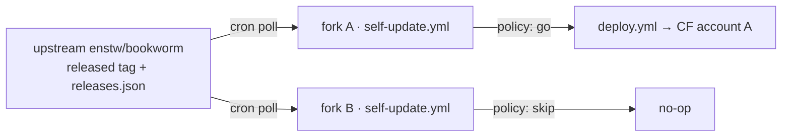

# Pull-mode updates — plan

Today one repo deploys one instance. `deploy.yml` fires `on: push` to
`main`, and the push *is* the decision: whatever lands is what ships, to
the single Cloudflare account whose token sits in that repo's secrets.
That is a 1:1 model, and it has no seat for a second instance.

The target is 1:N. One upstream repo, many self-hosted instances, and the
decision moves to the instance: each one asks upstream what shipped, and
decides for itself whether to take it or skip it. Upstream stops being the
thing that deploys and becomes the thing that publishes.

## The constraint everything else follows from

A Bookworm deploy is a **build**, not a file copy. `src/worker.js:8`
imports `../public/vendor/wasmtts/pack-manifest.mjs`; `public/vendor/` is
gitignored (`.gitignore:10`) and generated by `scripts/vendor.mjs` out of
`node_modules`. A bare `git pull` produces a tree that cannot bundle, let
alone deploy.

`scripts/deploy.sh` then does eight further account-level things around the
upload: `d1 create`, the `database_id` rewrite into `wrangler.jsonc`, `r2
bucket create`, applying `schema.sql` remotely, two idempotent `PRAGMA`-
guarded `ALTER TABLE` probes, stamping `BUILD` from `git rev-parse`,
`secret put`, and finally the smoke probe and `announce-build`.

So whatever pulls needs Node, pnpm, wrangler, git and network. That single
fact decides the shape.

## Shape: a scheduled workflow inside each fork

Each instance already is a fork with its own secrets and its own copy of
`deploy.yml`. The whole change is therefore a **trigger** change, not a
pipeline change: add a cron workflow that asks upstream what shipped,
applies the instance's own policy, and — only if the answer is yes — moves
the fork's `main` forward, at which point the existing `deploy.yml` runs
exactly as it does now.

Upstream already publishes the pointer this needs. `deploy.yml` moves the
`released` tag onto every commit that deployed green, and
`scripts/gen-release-notes.mjs` writes `public/releases.json`. An instance
polls `released` for *what*, and `releases.json` for *what changed* — no
new upstream publishing surface, no artifact registry, no signing keys.

### The two shapes rejected

**The Worker updates itself** through the Cloudflare API. Technically
possible — create an upload session with a file manifest, upload changed
files as base64 `multipart/form-data` against the one-hour JWT, `PUT` the
script with the completion token — but it requires upstream to publish a
prebuilt bundle (the vendor step above), reimplementing wrangler's
manifest, hashing and D1 migration inside a Worker, and an account-scoped
`Workers Scripts:Edit` token living *inside* the Worker, able to rewrite
the Worker. One leak becomes self-perpetuating account takeover. That
inverts the posture `deploy.yml` is built around: per-job permissions, a
credential-free `persist-credentials: false` checkout for the job that
executes pushed code, credentials only in the job that runs after a green
gate. There is also no test gate and no rollback on the instance side.

**An instance-side runner** on a VPS or a laptop works, and throws away the
property the install already advertises — that no machine needs a local
`.deploy.env`.

## The plan

1. **Stop forks from diverging.** `INSTALLATION.en.md:329` (and its
   Chinese twin) tells the operator to commit the `database_id` that
   `deploy.sh` writes into `wrangler.jsonc`. Every fork's `main` therefore
   sits at least one commit off upstream, on exactly the line upstream
   edits when the D1 config changes — so an update can never be a
   fast-forward, and the merge conflicts on the same line every time.
   `deploy.sh:26-34` already resolves the id at deploy time from the
   account it is deploying to, which means the committed value is
   redundant. Drop the advice, keep the rewrite ephemeral (or move the id
   to a repo variable), and every instance becomes a pure fast-forward of
   upstream. This is the one item that is a latent defect today rather
   than new work, and it lands first.

2. **`.github/workflows/self-update.yml`,** `on: schedule` plus
   `workflow_dispatch`. It resolves upstream's `released` tag through the
   API, compares it against the fork's own deployed commit, consults the
   policy file below, and either fast-forwards `main` (letting `deploy.yml`
   fire) or opens a PR and stops. It never runs a byte of the code it is
   about to ship — the decision job holds `contents: write` and nothing
   else, in the same spirit as the existing split.

3. **A committed policy file** the instance owns — channel (`pinned` /
   `released`), an optional pin, an optional minimum age so an instance can
   sit a day behind on purpose, and the auto-merge switch from the open
   question below. It is committed rather than a repo variable so the
   instance's intent is reviewable in its own history.

4. **Keep the schedule alive.** Two GitHub behaviours bite: scheduled
   workflows are disabled by default in a fork, and in a public repo they
   are auto-disabled after 60 days with no repository activity. The first
   is one more `gh workflow enable` in the install flow, beside the ones
   already there. The second is the real one: an instance that legitimately
   skips every update for 60 days stops checking *silently*, which is the
   worst failure mode this design can have. It needs an explicit
   mitigation — the workflow re-enabling itself through the API, or a
   heartbeat — not a footnote in the troubleshooting table.

5. **Decide the gate policy.** Re-running the full suite per instance costs
   20 minutes with Chrome and ffmpeg per update, per instance — free on a
   public fork, billable on a private one. Since `released` only ever moves
   onto a commit that already passed that exact gate upstream, the
   defensible default is to trust it and run a short smoke subset;
   re-running everything stays available for instances that want it.

6. **Extend `scripts/test-deploy-policy.mjs`.** It asserts the per-job
   permission split today, and `hardening/m-risks` is extending it to
   assert that every production-reaching job names an `environment:`. The
   new job must satisfy both. That branch lands first so this does not
   conflict with it.

7. **Rewrite *Update Bookworm*** in both `INSTALLATION.md` and
   `INSTALLATION.en.md`. It currently reads `gh repo sync` — a manual pull
   the operator remembers to run — and becomes the policy file plus the
   schedule.

## Already satisfied

Unattended repeated migration across many instances is normally what blocks
this, and it is already done: `schema.sql` is `CREATE TABLE IF NOT EXISTS`
throughout, and every added column is backfilled behind its own `PRAGMA
table_info` probe in `deploy.sh`, so re-applying it is a no-op. The rule to
keep is that it stays that way — with N instances at N different versions,
a migration that is not idempotent and backward-compatible has no safe
moment to run.

`announce-build` needs nothing either: each instance announces its own
stamp against its own `announced_builds` row, so N instances ringing N
phone sets is the existing behaviour, N times.

## Open question

Pull mode makes upstream able to change every instance without anyone
reading the diff. The default policy is the decision: **auto-merge and
deploy**, or **open a PR and wait for the operator**, with pinning
available either way. Auto is right for the owner's own phone; PR is right
the moment someone else's reading depends on the instance. Undecided.
