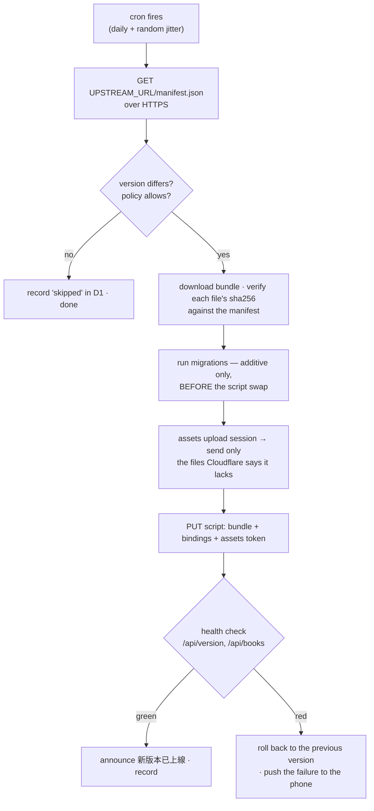

# Pull-mode updates — plan

Today one repo deploys one instance. `deploy.yml` fires `on: push` to
`main`, and the push *is* the decision: whatever lands ships, to the single
Cloudflare account whose token sits in that repo's secrets. There is no
seat in that model for a second instance.

The target is 1:N — one upstream, many self-hosted instances, each one
deciding for itself whether to take a release. Upstream stops deploying and
starts *publishing*; an instance polls, and installs itself.

An instance is **not a fork**. It is a Cloudflare account and nothing else:
no GitHub repo, no clone, no CI of its own. That constraint is what shapes
everything below.

## Status

A ticket's state changes **in the commit that changes it**, never in a
separate bookkeeping commit — a status table maintained on its own schedule
is a status table that lies. The ticket id goes in the commit *body*, not
the subject, which keeps `<area>: <one lowercase sentence>` intact and still
leaves `git log --grep=PM-05` working. This table is for the glance; git is
the audit trail.

States: `—` not started · `wip` in progress · `done` landed · `dropped`
(with the reason, inline).

| Ticket | Phase | State |
|---|---|---|
| PM-00 · prove a Worker can install 12 MB of assets | 0 | — |
| PM-01 · publish the artifact and its manifest | 1 | — |
| PM-02 · the manifest becomes a stated contract | 1 | — |
| PM-03 · a release can demand a human | 1 | — |
| PM-04 · split out `bookworm-updater` | 2 | — |
| PM-05 · the install path | 2 | — |
| PM-06 · migrations before the swap, additive-only | 2 | — |
| PM-07 · health check and automatic rollback | 3 | — |
| PM-15 · the rules for when an install may happen | 3 | — |
| PM-08 · the panel and the policy | 3 | — |
| PM-14 · alarm on a silent updater | 3 | — |
| PM-09 · the owner's phone, and only the owner's | 3 | — |
| PM-10 · a one-shot bootstrap replaces fork + Actions | 4 | — |
| PM-11 · rewrite `INSTALLATION.md` and `INSTALLATION.en.md` | 4 | — |
| PM-12 · DESIGN.md absorbs the decisions; this document goes away | 4 | — |
| PM-13 · two instances, one real release | 5 | — |

This document is scaffolding: PM-12 distils what is worth keeping into
DESIGN.md and deletes the rest, this table included. Measurements a spike
produces (PM-00) are written under their ticket first, because the design
downstream rests on them, and travel into DESIGN.md with everything else.

## What an instance looks like

Two Workers on the instance's account, and the split between them is the
one decision the whole design rests on:

| Worker | What it is | Holds the Cloudflare API token |
|---|---|---|
| `bookworm` | today's Worker — public routes, uploads, `/admin`, edge-tts | **no** |
| `bookworm-updater` | cron trigger only; no fetch handler, no route | yes |

Both bind the same D1, so the updater reads its policy and writes its
status where `/admin` can show them.

Three independent reasons the token lives in the second Worker, not the
first:

**Attack surface.** The reader Worker does everything risky — fetches
remote URLs, accepts uploads, exposes admin endpoints. It is the most
likely place for a hole, so it is the worst possible home for a credential
that can rewrite the Worker. The updater has no fetch handler at all:
nothing outside Cloudflare can invoke it.

**It must survive a brick.** If the updater lived inside the reader and a
bad release killed the reader, the updater would die with it and there
would be nothing left to roll back *with*. Separated, the updater is
untouched by whatever it just installed, and can put the previous version
back.

**It barely changes.** The updater does not follow the reader's feature
work. Keeping it small and stable makes "update the updater" a rare,
deliberate act rather than a weekly event.

## One update, end to end



### Why the asset step is smaller than it sounds

`public/` is 39 files and 12 MB, and the size is concentrated in things
that never change: `fonts/ENSFont.woff2` is 6.2 MB, `icons/icon-source.png`
2.9 MB, `vendor/opencc-cn2t.js` 1.1 MB. What actually moves in a release is
`app.js` (104 KB), `sw.js`, `app.css`, `i18n.js`.

Cloudflare's upload session takes a manifest and answers with the files it
is missing, so **the first install moves 12 MB and a typical update moves
about 200 KB**. Sizing the design around 12 MB per update would have been
sizing it around the wrong number.

(`icons/icon-source.png` is the input to `scripts/make-icons.mjs` and has no
business being served at all — 2.9 MB of the upload is dead weight today.)

## The artifact

Nothing produces one today: wrangler bundles and uploads in one motion and
the intermediate bytes are never kept. Upstream's `deploy.yml` gains a step
that publishes them, described by a manifest:

```jsonc
{
  "version": "9a3855f · 2026-08-19 15:53",
  "worker":  { "path": "worker.js", "sha256": "…" },
  "assets":  [ { "path": "/app.js", "sha256": "…", "size": 106496 }, … ],
  "bundle":  { "url": "…/bookworm-9a3855f.zip", "sha256": "…" },

  // the artifact declares the SHAPE of what it needs; the instance owns the
  // VALUES (its own D1 id, its own bucket). Crossing that line is R4 below.
  "bindings": [ {"type":"d1","name":"DB"}, {"type":"r2_bucket","name":"BOOKS"},
                {"type":"assets","name":"ASSETS"} ],
  "compatibility_date": "2026-06-01",
  "assetsConfig": { "not_found_handling": "single-page-application",
                    "run_worker_first": ["/api/*","/books/*","/admin"] },

  "migrations": ["ALTER TABLE books ADD COLUMN …"],
  "requiresAttention": false,   // forces review-first regardless of policy
  "minUpdaterVersion": 3        // an older updater refuses rather than half-installs
}
```

The zip is unpacked with `fflate`, which is already vendored for the browser.

## Trust: TLS, and why there is no signature

The trust anchor is `UPSTREAM_URL` over HTTPS. There is no signing key and
no pinned public key, and that is a decision, not an omission.

This system already executes upstream bytes on the strength of TLS alone.
`serveWasmttsAsset` (`src/worker.js:581`) fetches the Matcha acoustic model,
the vocoder, the lexicon and **ort's WebAssembly** from a pinned GitHub
release tag, proxies them same-origin, and the page compiles and runs them.
Nothing verifies a hash at runtime; the protection is TLS plus a name
allowlist on a pinned tag. Signing the update artifact while that door
stands open would be a lock beside an open door.

The second reason is that a signature here would not cross a real boundary.
The key would have to live in upstream's GitHub Actions secrets, or releases
stop being automatic — the same trust boundary that produces the artifact.
Compromise the repo and you have both.

So the accepted risk, stated plainly rather than assumed:

> **Fleet integrity equals the integrity of the upstream GitHub account.**

That is already true today through the wasmtts path; pull mode widens its
blast radius rather than creating it. The consequence is that upstream's
2FA, secret scanning with push protection, and the main ruleset (recorded
under *Repo settings outside the tree*) stop being repo hygiene and become
fleet infrastructure — they should be treated with that weight.

Three things survive the decision to drop signing, because none of them was
ever about signing:

1. **Per-file `sha256` from the manifest stays.** It is *download
   integrity*, not *source authenticity*: it catches truncation, a corrupt
   zip, a CDN serving half a release. It means "these files match the
   manifest I fetched", never "this manifest is genuine". Documented that
   way so nobody later mistakes it for signature-grade protection.
2. **`https://` is enforced, not assumed.** TLS is the whole anchor now, so
   an `UPSTREAM_URL` with any other scheme is refused at startup.
3. **`UPSTREAM_URL` stays a Worker secret, never `/admin`.** This defends
   against an admin-token leak escalating into permanent account takeover,
   which has nothing to do with signing — and matters *more* without it,
   since the URL is now the entire trust decision.

Where each knob lives:

| Setting | Home | Who can change it |
|---|---|---|
| `UPSTREAM_URL`, `CF_API_TOKEN` | updater's Worker secrets | the Cloudflare account holder |
| policy: auto / notify-only / pinned / minimum age | D1 | `/admin` (admin token) |
| update history and status | D1 | read-only display |

## What `/admin` shows, and how it knows

**`/admin` never contacts upstream.** It is served by the reader Worker,
which holds no credential and has no relationship with upstream at all. The
updater is the only thing that talks outward; it writes what it found to
D1, and `/admin` reads that.

This is deliberate rather than lazy. The moment `/admin` fetches upstream
itself, the reader Worker — the largest attack surface in the system —
reacquires a trust relationship with upstream. There is exactly one such
relationship and it lives in the updater.

### Checking and installing run at different rates

A daily cron would leave `/admin` claiming "up to date" twenty hours after
a release. The fix is to separate the two things the cron does, because
they have nothing in common but a timer:

| | Frequency | Cost | Why |
|---|---|---|---|
| **check** | short interval (~15 min) | one HTTPS GET of a small JSON | read-only, no side effect, too cheap to ration |
| **install** | per policy (daily + jitter) | full upload | this is the part with risk, policy and blast radius |

`/admin` is then never more than one check interval stale, and needs no
"check now" button. R9's jitter still applies, because jitter belongs on
the install, not on the check.

### The panel

```
running          9a3855f · 2026-08-19 15:53     ← the reader's own BUILD
upstream         3f21ac0 · 2026-08-21 09:12     ← what the updater last saw
                 └ update available · what changed

last checked     2026-08-21 09:20 (4 minutes ago)
policy           install automatically ▾   after 2 days
last install     2026-08-19 15:55 · ok
```

Two states have to be visible and are easy to forget: a release upstream
marked `requiresAttention` (say so, and do not install it whatever the
policy says), and an install that failed and rolled back (it stays on the
panel — a push that scrolls away is not a record).

### An install button, without giving the updater a door

Notify-only mode needs an "install now" button, and the reader cannot call
the updater — no fetch handler, on purpose.

A service binding would work: the updater gains an entrypoint reachable
only by the bound Worker and never from the internet. If it is ever built
that way, the red line is that **the entrypoint takes no arguments at
all** — the moment it accepts a URL, compromising the reader means choosing
what gets installed, and the whole split was for nothing.

It is not worth it. `/admin` writes a request row into D1 and the updater
picks it up on its next check; with checks every 15 minutes, "queued" costs
a quarter of an hour and the updater keeps its property of having no
callable surface whatsoever.

## Deciding to install

Three modes and one number, not a matrix of knobs:

| Mode | Behaviour |
|---|---|
| **automatic** | install a new release once it has been out for N days |
| **notify me** | push and show it; wait for the button |
| **pinned** | stay here. Still checks, so the panel can say a newer one exists, but never installs and never nags |

**The default is automatic, after 2 days.** The failure that actually
befalls a self-hosted site is not taking a bad release — it is nobody
tending it while it quietly rots. Automatic with a wait, plus the overrides
below, is a smaller risk than that, and "notify me" is one click away for
anyone who disagrees.

### The wait is the cheapest safety in this design

`released` only moves onto commits CI called green, so the residual danger
is a bug the suite did not catch. If every instance installs on sight, R9
happens: they all break together. If instances wait, and **upstream's own
instance runs with a wait of zero**, the author is always first to hit it
and has the window to pull or fix the release before the fleet takes it.

That makes upstream's own site the fleet's canary, and it costs no code at
all — only setting the default of one number correctly.

### Three overrides that are not the owner's choice

1. **`requiresAttention` downgrades automatic to notify.** Upstream saying a
   release needs a human is not a preference to weigh.
2. **A `minUpdaterVersion` newer than this updater refuses the release** and
   tells the owner. Stopping is always better than installing half of it.
3. **A version that failed to install is never retried automatically.**

The third is mandatory rather than nice. After a rollback the failed version
is *still newer than what is running*, so the next check finds it, installs
it, fails, and rolls back again — an unbounded loop of real installs against
a live site. The failure is recorded and that exact version is skipped
until the owner retries it by hand.

The rule has to be precise, though: **only the exact failed version is
blocked, never everything after it.** When upstream ships the next one it
gets installed normally — the fix is probably in it.

### Two safeguards on the install itself

- **Measure health before installing, not only after.** A rollback decision
  compares against the pre-install state; without that baseline, a site that
  was already broken oscillates install → red → roll back forever, blaming
  each new release for damage that predates it.
- **One install at a time**, held by a lock in D1, so an overrunning cron
  and a queued "install now" cannot interleave.

## Who gets told

The identity model already exists: `push_subs.user` comes from a reader key,
and `readers` holds one row per key with a label, minted on `/admin`. The
only missing piece is a flag saying which of those devices is the owner's —
`readers.is_owner`, a new column, additive, under the same rule as every
other schema change here (PM-06).

The flag sits on the **key**, not the user: one key per device is the
existing design, a household can share a `user`, and the owner may carry two
devices.

| Message | Audience |
|---|---|
| 新版本已上線 — installed, reload | **everyone** (unchanged: readers do need to reload) |
| a release is waiting for your decision | owner only |
| an install failed and was rolled back | owner only |
| the updater has not reported in N days (R10) | owner only |

`announceBuild` broadcasts to every row in `push_subs` today, which stays
right for the first line. The other three select only endpoints whose user
owns a key flagged `is_owner`.

**With no device flagged, nothing is sent** — deliberately, rather than
falling back to broadcasting the owner's business to every reader. But
`/admin` then has to say so in as many words: *no device is marked as the
owner's, so these notifications are not being sent.* An unset state that
looks identical to a quiet one is the same defect as R10, one screen over.

One flag serves all three messages, so this is not machinery built for a
single notification.

## Risks

### Fatal — the design is not defensible without these

**R1 · a token that can rewrite the Worker.** Intrinsic to this model; it
cannot be designed away, only moved. Moving it to a Worker with no fetch
handler is the mitigation. Residual: compromise the updater and everything
is lost — but there is no route to it from outside.

**R2 · nobody reads a diff.** In fork mode an operator could read the
change and decline it. Here they cannot. Combined with the trust decision
above, a malicious release is unrecoverable *by update*: the verification
code is itself part of what gets replaced. One-way door.

**R3 · bricking.** A bad release must not be able to take the thing that
would have fixed it. This is what the two-Worker split buys, and the health
check plus automatic rollback is what spends it.

### Severe — quiet data loss or lockout

**R4 · bindings and secrets wiped on upload.** The script upload API
replaces the binding set wholesale. One omission unbinds D1 or R2, or
clears `ADMIN_TOKEN` and locks the owner out of their own `/admin`. The
updater must rebuild the complete set from values it holds, or use the
API's keep-bindings path — and this needs a test that fails loudly.

**R5 · migration ordering.** New code needing a new column requires the
migration to land *before* the script swap; a failed swap then leaves old
code facing an extra column. Additive-only and backward-compatible is
therefore a hard rule, not a habit. The house pattern already complies
(`CREATE TABLE IF NOT EXISTS`, every `ALTER` behind its own `PRAGMA`
probe) — this promotes it to a rule with a gate.

**R6 · `wrangler.jsonc` stops being the truth.** `run_worker_first`,
`not_found_handling` and the compatibility date are read by wrangler today
and must travel in the manifest instead. A gap here produces
hard-to-diagnose behaviour — `/admin` served as a static file, for one.

**R7 · admin-token escalation.** Answered by keeping the trust anchor in a
Worker secret; recorded here so the reasoning is not lost if someone later
proposes moving the URL into the admin UI for convenience.

**R10 · the updater dies without a sound.** It is cron-only with no route,
which is exactly what makes it silent when it stops: an expired token, a
revoked credential, a changed API, a cron that stopped firing — every one of
them looks identical from outside, because the only symptom is that a
timestamp in D1 stops moving. A panel that says "up to date" on stale data
looks precisely like a panel that says "up to date" on fresh data.

This is the same shape as the GitHub 60-day auto-disable that the fork model
died of; dropping the fork removed that instance of it, not the class. So
`/admin` always shows **when the last check happened**, and past a threshold
(a few times the check interval) that line becomes a warning rather than
grey text. *How long since it checked* is the more important of the two
numbers, because when it goes wrong, *what version is upstream* is a lie.

### To be measured, not assumed

**R8 · can a Worker finish the first install at all?** 39 files, 12 MB,
base64-inflated, against the free plan's 50-subrequest ceiling and whatever
CPU and wall-clock a scheduled invocation actually gets. Ordinary updates
touch a handful of files and are clearly fine; **the 12 MB first install is
the open question, and it can invalidate the design.** Phase 0 exists for
exactly this.

**R9 · one release, N sites down.** A green release can still break every
instance at once. Mitigated by jitter on the cron, a minimum-age policy,
and upstream's `requiresAttention` flag — not eliminated.

## Phases and tickets

Ticket ids are stable; `needs` is a hard ordering.

### Phase 0 — the spike that can kill this

**PM-00 · prove a Worker can install 12 MB of assets**
- Why: R8. Every other ticket assumes this works. Find out before building
  anything on top of it — including how many subrequests an upload session
  actually costs and what a scheduled invocation gets to spend.
- Done when: a throwaway Worker has uploaded the real `public/` to a real
  account, with the measured numbers written down. If it cannot, the answer
  is a bootstrap-assisted first install, and the plan below changes shape.

### Phase 1 — upstream starts shipping a product

**PM-01 · publish the artifact and its manifest**
- Touches: `.github/workflows/deploy.yml`, new packaging script
- Why: nothing produces a deployable bundle today — the bundler's output is
  uploaded and discarded in one motion. The manifest carries the asset
  hashes, the binding shape, the assets config and the migrations.
- Also drop `icons/icon-source.png` from what gets served.

**PM-02 · the manifest becomes a stated contract**
- Touches: `DESIGN.md`, `scripts/test-deploy-policy.mjs`
- Why: N instances will depend on its shape unattended. Changing or losing
  it silently strands the fleet, so it needs the same kind of gate the
  permission split has.

**PM-03 · a release can demand a human**
- Why: `requiresAttention` is what lets upstream ship a change needing a new
  secret or a non-additive migration without gambling on every instance's
  policy.
- Needs: PM-01

### Phase 2 — the updater

**PM-04 · split out `bookworm-updater`**
- Why: the whole security and recoverability argument above. Cron-only, no
  fetch handler, its own tiny surface.
- Done when: the reader Worker holds no Cloudflare credential.

**PM-05 · the install path**
- Why: manifest → verify → upload session → script PUT, with the binding
  set rebuilt from instance-held values (R4) and the assets config applied
  from the manifest (R6). `https://`-only, enforcing the trust anchor.
- Needs: PM-00, PM-01, PM-04

**PM-06 · migrations before the swap, additive-only**
- Why: R5, promoted from habit to gate.
- Needs: PM-05

### Phase 3 — safe to leave alone

**PM-07 · health check and automatic rollback**
- Why: R3. Spends what the split bought.
- Includes the pre-install baseline: a rollback decision compares against
  the state before the install, or an already-broken site oscillates.
- Needs: PM-05

**PM-15 · the rules for when an install may happen**
- Why: distinct from *how* to install (PM-05) and *did it work* (PM-07) —
  this is the decision itself. The soak, the three overrides
  (`requiresAttention` downgrades to notify, a too-new `minUpdaterVersion`
  refuses, a failed version is never auto-retried), and the D1 install lock.
- The failed-version rule needs a test proving the exact version is blocked
  and the *next* one still installs; getting that backwards is either an
  install loop or a permanently stuck instance.
- Needs: PM-05

**PM-08 · the panel and the policy**
- Why: `/admin` reads the updater's D1 record and never contacts upstream
  (see *What `/admin` shows*). Carries the running version, what upstream
  last offered, when it was last checked, the policy, and the last install's
  outcome — including a rolled-back one, which stays on the panel.
- Also splits the cron into a short check interval and a policy-driven
  install, and queues an "install now" request through D1 rather than
  opening a callable surface on the updater.
- Ships the default: automatic, after 2 days.

**PM-14 · alarm on a silent updater**
- Why: R10. A cron-only Worker fails invisibly, and stale data on the panel
  is indistinguishable from fresh data. `/admin` warns past a staleness
  threshold, and the owner gets told.
- Needs: PM-08

**PM-09 · the owner's phone, and only the owner's**
- Why: the owner watches a phone, not a repo — but three of the four update
  messages are the owner's business, not every reader's. Adds
  `readers.is_owner` and routes the waiting-for-you, failed-and-rolled-back
  and updater-silent pushes to it; 新版本已上線 stays a broadcast.
- With no device flagged, nothing is sent, and `/admin` says that plainly.
- Needs: PM-08

### Phase 4 — bootstrap and docs

**PM-10 · a one-shot bootstrap replaces fork + Actions**
- Why: dropping the fork removes the repo from *updating*, not from
  *installing* — someone still has to place two Workers, create D1 and R2,
  and set secrets the first time, and no Worker can do that before it
  exists. A single local command is the honest answer: one-time friction
  traded against permanent friction.

**PM-11 · rewrite `INSTALLATION.md` and `INSTALLATION.en.md`**
- Why: both are built end to end on fork + `gh workflow run`. This is a
  rewrite, not an edit.
- Needs: PM-10

**PM-12 · DESIGN.md absorbs the decisions; this document goes away**
- Why: house rule — decisions worth keeping are distilled into the relevant
  subsystem section, superseded ones are deleted rather than annotated.

### Phase 5 — prove it

**PM-13 · two instances, one real release**
- Why: everything above is reasoning about a fleet of one.
- Done when: one instance took an upstream release on its own schedule and
  a pinned instance beside it correctly did nothing — with nobody
  installing either by hand.
