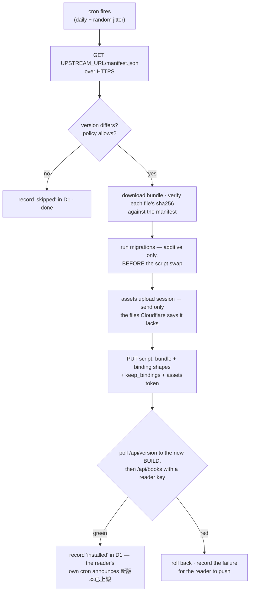

# Pull-mode updates — plan

Today one repo deploys one instance. `deploy.yml` fires `on: push` to
`main`, and the push *is* the decision: whatever lands ships, to the single
Cloudflare account whose token sits in that repo's secrets. There is no
seat in that model for a second instance.

The target is 1:N — one upstream, many self-hosted instances, each one
deciding for itself whether to take a release. Upstream stops deploying and
starts *publishing*; an instance polls, and installs itself.

An instance is **not a fork**. It is a Cloudflare account and nothing else:
no GitHub repo, no clone, no CI of its own. That constraint is what shapes
everything below.

## Status

A ticket's state changes **in the commit that changes it**, never in a
separate bookkeeping commit — a status table maintained on its own schedule
is a status table that lies. The ticket id goes in the commit *body*, not
the subject, which keeps `<area>: <one lowercase sentence>` intact and still
leaves `git log --grep=PM-05` working. This table is for the glance; git is
the audit trail.

States: `—` not started · `wip` in progress · `done` landed · `dropped`
(with the reason, inline).

| Ticket | Phase | State |
|---|---|---|
| PM-00 · prove a Worker can install 12 MB of assets | 0 | done |
| PM-01 · publish the artifact and its manifest | 1 | done |
| PM-02 · the manifest becomes a stated contract | 1 | done |
| PM-03 · a release can demand a human | 1 | wip — publishing half landed, honouring half waits on PM-15 |
| PM-04 · split out `bookworm-updater` | 2 | done — check landed; token+install are PM-05 |
| PM-05 · the install path | 2 | done — built and proven; armed by PM-07/PM-15 |
| PM-06 · migrations before the swap, additive-only | 2 | done |
| PM-07 · health check and automatic rollback | 3 | done — built and proven; armed by PM-15 |
| PM-15 · the rules for when an install may happen | 3 | done — decision + lock; wired by PM-08 |
| PM-08 · the panel and the policy | 3 | done — panel + cron split; armed by the owner's token |
| PM-14 · alarm on a silent updater | 3 | done |
| PM-09 · the owner's phone, and only the owner's | 3 | wip — channel landed, messages pending |
| PM-10 · a one-shot bootstrap replaces fork + Actions | 4 | — |
| PM-16 · updating the updater | 4 | — |
| PM-11 · rewrite `INSTALLATION.md` and `INSTALLATION.en.md` | 4 | — |
| PM-12 · DESIGN.md absorbs the decisions; this document goes away | 4 | — |
| PM-13 · two instances, one real release | 5 | — |

This document is scaffolding: PM-12 distils what is worth keeping into
DESIGN.md and deletes the rest, this table included. Measurements a spike
produces (PM-00) are written under their ticket first, because the design
downstream rests on them, and travel into DESIGN.md with everything else.

## Why an instance is not a fork

The obvious shape is a fork each: an instance would already hold the source,
its own secrets and a copy of `deploy.yml`, so following upstream would be a
*trigger* change rather than a pipeline change. It was planned that way
first and dropped, because a fork inherits the entire upstream pipeline and
then has to be stopped from using most of it.

- The release ledger step commits `RELEASES.md`, opens a PR and merges it —
  **on every fork deploy**. The fork re-diverges permanently, so no update is
  ever a fast-forward again. It also drags each instance through
  `scripts/wait-candidate-gate.mjs`, fail-closed on every path, waiting on a
  required check that exists because of *upstream's* ruleset, not the fork's.
- `sync-wasmtts-assets.mjs` re-cuts a release nothing will read:
  `WASMTTS_RELEASE` (`src/worker.js:581`) is hard-coded to `enstw/bookworm`,
  so every instance already pulls the models and ort's wasm from upstream.
- `INSTALLATION` tells the operator to commit the D1 `database_id` that
  `deploy.sh` writes into `wrangler.jsonc` — one guaranteed divergent commit
  per fork, on exactly the line upstream edits.
- Scheduled workflows are disabled by default in a fork, and a public repo's
  schedule is auto-disabled after 60 days without activity: an instance that
  legitimately skips releases for two months stops checking **silently**.

The first three are defects in a fork today, pull mode or not. What a fork
bought in exchange was source, Node and pnpm on the instance side — the
ability to *build*. Giving that up is precisely why upstream must start
publishing a built artifact, and why phase 1 exists at all.

## What an instance looks like

Two Workers on the instance's account, and the split between them is the
one decision the whole design rests on:

| Worker | What it is | Holds the Cloudflare API token |
|---|---|---|
| `bookworm` | today's Worker — public routes, uploads, `/admin`, edge-tts | **no** |
| `bookworm-updater` | cron trigger only; no fetch handler, no route | yes |

Both bind the same D1, so the updater reads its policy and writes its
status where `/admin` can show them.

Three independent reasons the token lives in the second Worker, not the
first:

**Attack surface.** The reader Worker does everything risky — fetches
remote URLs, accepts uploads, exposes admin endpoints. It is the most
likely place for a hole, so it is the worst possible home for a credential
that can rewrite the Worker. The updater has no fetch handler at all:
nothing outside Cloudflare can invoke it.

This pillar is about the Cloudflare token alone. It says nothing about
`ADMIN_TOKEN` or the VAPID pair: those stay in the reader under any design,
because the reader is what serves `/admin` and sends push. The split does
not move them, and copying them into the updater would not move them
either. Why the updater nevertheless gets no copy is a separate argument,
and it is not a security one — see R4.

**It must survive a brick.** If the updater lived inside the reader and a
bad release killed the reader, the updater would die with it and there
would be nothing left to roll back *with*. Separated, the updater is
untouched by whatever it just installed, and can put the previous version
back.

**It barely changes.** The updater does not follow the reader's feature
work, and under R4's decision it does not follow the reader's *secret*
surface either — a mirrored secret set would mean every new reader secret
is also a change to the updater. Keeping it small and stable makes "update
the updater" a rare, deliberate act rather than a weekly event.

## One update, end to end



### Why the asset step is smaller than it sounds

`public/` is 42 files and 12 MB, and the size is concentrated in things
that never change: `fonts/ENSFont.woff2` is 6.2 MB, `icons/icon-source.png`
2.9 MB, `vendor/opencc-cn2t.js` 1.1 MB. What actually moves in a release is
`app.js` (104 KB), `sw.js`, `app.css`, `i18n.js`.

Cloudflare's upload session takes a manifest and answers with the files it
is missing — missing from *this script's* store, PM-00 measured, not the
account's — so **the first install moves 12 MB and a typical update moves
about 200 KB**. Sizing the design around 12 MB per update would have been
sizing it around the wrong number.

(`icons/icon-source.png` is the input to `scripts/make-icons.mjs` and has no
business being served at all — 2.9 MB of the upload is dead weight today.)

## The artifact

Nothing produces one today: wrangler bundles and uploads in one motion and
the intermediate bytes are never kept. Upstream's `deploy.yml` gains a step
that publishes them, described by a manifest:

```jsonc
{
  "version":     "9a3855f · 2026-08-19 15:53",  // the reader's BUILD, verbatim
  "released_at": "2026-08-19T07:53:12.000Z",    // the soak clock, see below
  "tag":         "release-9a3855f",             // the GitHub release it rides on
  "worker":  { "file": "worker.js", "sha256": "…", "size": 59786 },
  // cfhash is what the upload session keys on: blake3(base64(bytes)+ext),
  // 32 hex — not sha256. Shipped so the updater never computes it (PM-00).
  // `file` is where the bytes sit inside the zip; `path` is the URL.
  "assets":  [ { "path": "/app.js", "file": "public/app.js",
                 "sha256": "…", "cfhash": "…", "size": 102734 }, … ],
  "bundle":  { "url": "https://github.com/<owner>/<repo>/releases/download/release-9a3855f/bookworm-9a3855f.zip",
               "file": "bookworm-9a3855f.zip", "sha256": "…", "size": 7994190 },

  // the artifact declares the SHAPE of what it needs; the instance owns the
  // VALUES (its own D1 id, its own bucket). Crossing that line is R4 below.
  "bindings": [ {"type":"d1","name":"DB"}, {"type":"r2_bucket","name":"BOOKS"},
                {"type":"assets","name":"ASSETS"} ],
  "compatibility_date": "2026-06-01",
  "compatibility_flags": [],
  "assetsConfig": { "not_found_handling": "single-page-application",
                    "run_worker_first": ["/api/*","/books/*","/admin"] },

  "migrations": [],             // additive SQL, run before the swap — PM-06 fills it
  "requiresAttention": false,   // THIS release needs a human; forces review-first
  // every commit in history that did, each dated by its own stamp, so an
  // instance that skipped the release in the middle still sees it (PM-03)
  "attention": [ { "commit": "1f2e3d4", "version": "1f2e3d4 · 2026-07-01 09:12",
                   "reason": "set NEW_SECRET before installing" } ],
  "minUpdaterVersion": 1        // an older updater refuses rather than half-installs
}
```

This is what `scripts/package-release.mjs` writes today (PM-01), and
`scripts/test-release-manifest.mjs` is the table above as a gate (PM-02):
exact field set and types, hashes re-derived from the zip, two packagings of
one tree hashing the same, seeded violations each caught. `bindings`,
`compatibility_*` and `assetsConfig` are read out of `wrangler.jsonc`, not
typed a second time (R6).

The zip is unpacked with `fflate`, which is already vendored for the browser.

`version` is the display string `deploy.sh` stamps into the worker and
`app.js` (`scripts/deploy.sh:102`), so the panel can compare it to the
reader's own `BUILD` without translating anything. It is an *identity* — it
answers "differs?" and keys the failed-version block — and nothing more.
`released_at` is separate because the soak ("install once it has been out
for N days") needs an instant a machine can subtract. Parsing it back out of
the display string would be fragile, and the obvious substitute — when this
updater first saw the release — is wrong in the one case that matters: a
freshly bootstrapped instance would soak a release that has been out for
months.

### Where it is published

Upstream cuts a **GitHub release per deploy**, and `UPSTREAM_URL` is that
repo's `releases/latest/download/`. This is not a free choice — the trust
section below fixes it. Fleet integrity is already defined as the integrity
of the upstream GitHub account; publishing to a bucket or a domain instead
would add a second thing every instance has to trust, for nothing.

Nothing cuts such a release today. `deploy.yml` marks a deploy with the
`released` git tag and the `RELEASES.md` ledger, and its only
`gh release create` is the test-failure pre-release. Adding one is PM-01's
work, not a step that already exists.

One rule comes with the choice: **the manifest must never be read from
cache.** `latest/download` is a stable URL whose contents change, polled
every check interval, and a cached copy is indistinguishable from "no new
release" — R10's symptom with a different cause, and one the panel would
report as healthy. The check fetches it uncached; the bundle is per-version
and immutable, so that may be cached freely.

## Trust: TLS, and why there is no signature

The trust anchor is `UPSTREAM_URL` over HTTPS. There is no signing key and
no pinned public key, and that is a decision, not an omission.

This system already executes upstream bytes on the strength of TLS alone.
`serveWasmttsAsset` (`src/worker.js:581`) fetches the Matcha acoustic model,
the vocoder, the lexicon and **ort's WebAssembly** from a pinned GitHub
release tag, proxies them same-origin, and the page compiles and runs them.
Nothing verifies a hash at runtime; the protection is TLS plus a name
allowlist on a pinned tag. Signing the update artifact while that door
stands open would be a lock beside an open door.

The second reason is that a signature here would not cross a real boundary.
The key would have to live in upstream's GitHub Actions secrets, or releases
stop being automatic — the same trust boundary that produces the artifact.
Compromise the repo and you have both.

So the accepted risk, stated plainly rather than assumed:

> **Fleet integrity equals the integrity of the upstream GitHub account.**

That is already true today through the wasmtts path; pull mode widens its
blast radius rather than creating it. The consequence is that upstream's
2FA, secret scanning with push protection, and the main ruleset (recorded
under *Repo settings outside the tree*) stop being repo hygiene and become
fleet infrastructure — they should be treated with that weight.

Three things survive the decision to drop signing, because none of them was
ever about signing:

1. **Per-file `sha256` from the manifest stays.** It is *download
   integrity*, not *source authenticity*: it catches truncation, a corrupt
   zip, a CDN serving half a release. It means "these files match the
   manifest I fetched", never "this manifest is genuine". Documented that
   way so nobody later mistakes it for signature-grade protection.
2. **`https://` is enforced, not assumed.** TLS is the whole anchor now, so
   an `UPSTREAM_URL` with any other scheme is refused at startup.
3. **`UPSTREAM_URL` stays a Worker secret, never `/admin`.** This defends
   against an admin-token leak escalating into permanent account takeover,
   which has nothing to do with signing — and matters *more* without it,
   since the URL is now the entire trust decision.

Where each knob lives:

| Setting | Home | Who can change it |
|---|---|---|
| `UPSTREAM_URL`, `CF_API_TOKEN`, the instance's own URL — no reader secret (R4) | updater's Worker secrets | the Cloudflare account holder |
| policy: auto / notify-only / pinned / minimum age | D1 | `/admin` (admin token) |
| update history and status | D1 | read-only display |

## What `/admin` shows, and how it knows

**`/admin` never contacts upstream.** It is served by the reader Worker,
which holds no credential and has no relationship with upstream at all. The
updater is the only thing that talks outward; it writes what it found to
D1, and `/admin` reads that.

This is deliberate rather than lazy. The moment `/admin` fetches upstream
itself, the reader Worker — the largest attack surface in the system —
reacquires a trust relationship with upstream. There is exactly one such
relationship and it lives in the updater.

### Checking and installing run at different rates

A daily cron would leave `/admin` claiming "up to date" twenty hours after
a release. The fix is to separate the two things the cron does, because
they have nothing in common but a timer:

| | Frequency | Cost | Why |
|---|---|---|---|
| **check** | short interval (~15 min) | one HTTPS GET of a small JSON | read-only, no side effect, too cheap to ration |
| **install** | per policy (daily + jitter) | full upload | this is the part with risk, policy and blast radius |

`/admin` is then never more than one check interval stale, and needs no
"check now" button. R9's jitter still applies, because jitter belongs on
the install, not on the check.

### The panel

```
running          9a3855f · 2026-08-19 15:53     ← the reader's own BUILD
upstream         3f21ac0 · 2026-08-21 09:12     ← what the updater last saw
                 └ update available · what changed

last checked     2026-08-21 09:20 (4 minutes ago)
policy           install automatically ▾   after 2 days
last install     2026-08-19 15:55 · ok
```

Two states have to be visible and are easy to forget: a release upstream
marked `requiresAttention` (say so, and do not install it whatever the
policy says), and an install that failed and rolled back (it stays on the
panel — a push that scrolls away is not a record).

### An install button, without giving the updater a door

Notify-only mode needs an "install now" button, and the reader cannot call
the updater — no fetch handler, on purpose.

A service binding would work: the updater gains an entrypoint reachable
only by the bound Worker and never from the internet. If it is ever built
that way, the red line is that **the entrypoint takes no arguments at
all** — the moment it accepts a URL, compromising the reader means choosing
what gets installed, and the whole split was for nothing.

It is not worth it. `/admin` writes a request row into D1 and the updater
picks it up on its next check; with checks every 15 minutes, "queued" costs
a quarter of an hour and the updater keeps its property of having no
callable surface whatsoever.

## Deciding to install

Three modes and one number, not a matrix of knobs:

| Mode | Behaviour |
|---|---|
| **automatic** | install a new release once it has been out for N days |
| **notify me** | push and show it; wait for the button |
| **pinned** | stay here. Still checks, so the panel can say a newer one exists, but never installs and never nags |

**The default is automatic, after 2 days.** The failure that actually
befalls a self-hosted site is not taking a bad release — it is nobody
tending it while it quietly rots. Automatic with a wait, plus the overrides
below, is a smaller risk than that, and "notify me" is one click away for
anyone who disagrees.

### The wait is the cheapest safety in this design

`released` only moves onto commits CI called green, so the residual danger
is a bug the suite did not catch. If every instance installs on sight, R9
happens: they all break together. If instances wait, and **upstream's own
instance runs with a wait of zero**, the author is always first to hit it
and has the window to pull or fix the release before the fleet takes it.

That makes upstream's own site the fleet's canary, and it costs no code at
all — only setting the default of one number correctly.

### Three overrides that are not the owner's choice

1. **`requiresAttention` downgrades automatic to notify.** Upstream saying a
   release needs a human is not a preference to weigh.
2. **A `minUpdaterVersion` newer than this updater refuses the release** and
   tells the owner. Stopping is always better than installing half of it.
3. **A version that failed to install is never retried automatically.**

The third is mandatory rather than nice. After a rollback the failed version
is *still newer than what is running*, so the next check finds it, installs
it, fails, and rolls back again — an unbounded loop of real installs against
a live site. The failure is recorded and that exact version is skipped
until the owner retries it by hand.

The rule has to be precise, though: **only the exact failed version is
blocked, never everything after it.** When upstream ships the next one it
gets installed normally — the fix is probably in it.

### Two safeguards on the install itself

- **Measure health before installing, not only after.** A rollback decision
  compares against the pre-install state; without that baseline, a site that
  was already broken oscillates install → red → roll back forever, blaming
  each new release for damage that predates it.
- **One install at a time**, held by a lock in D1, so an overrunning cron
  and a queued "install now" cannot interleave.

## Who gets told

The identity model already exists: `push_subs.user` comes from a reader key,
and `readers` holds one row per key with a label, minted on `/admin`. The
only missing piece is a flag saying which of those devices is the owner's —
`readers.is_owner`, a new column, additive, under the same rule as every
other schema change here (PM-06).

The flag sits on the **key**, not the user: one key per device is the
existing design, a household can share a `user`, and the owner may carry two
devices.

| Message | Audience |
|---|---|
| 新版本已上線 — installed, reload | **everyone** (unchanged: readers do need to reload) |
| a release is waiting for your decision | owner only |
| an install failed and was rolled back | owner only |
| the updater has not reported in N days (R10) | owner only |

`announceBuild` broadcasts to every row in `push_subs` today, which stays
right for the first line. The other three go through one sender,
`pushOwner()`, which selects only the endpoints **registered by** a key
flagged `is_owner`. That needs the subscription to remember its key —
`push_subs` held only the `user` — so `push_subs.key` is added beside the
flag (additive; `healPush()` re-upserts every phone's row at each open, so
it fills itself in). Joining on the user instead would have sent the
owner's business to every device sharing that user, which is exactly the
household case the flag was put on the key for. *Landed ahead of phase 3 —
see PM-09.*

**With no device flagged, nothing is sent** — deliberately, rather than
falling back to broadcasting the owner's business to every reader. But
`/admin` then has to say so in as many words: *no device is marked as the
owner's, so these notifications are not being sent.* An unset state that
looks identical to a quiet one is the same defect as R10, one screen over.

One flag serves all three messages, so this is not machinery built for a
single notification.

### The reader sends, the updater only records

All four messages are sent by the **reader** Worker, off a cron of its own,
reading rows the updater wrote. The updater holds no VAPID key and never
pushes.

This is not a preference. R10's message — *the updater has not reported in
N days* — cannot come from the updater, because a dead updater cannot
report its own death. Something else has to watch that timestamp, and the
only other thing on the account is the reader, which already holds the
VAPID pair. Once the reader is the sender for one of the four, making it
the sender for all four costs nothing and keeps R4's decision intact.

It is also the pattern the design already chose for the install button
(*An install button, without giving the updater a door*), pointed the other
way: one Worker writes a row, the other acts on it, and neither can call
the other.

And it deletes machinery rather than adding it. `announceBuild` carries a
`?build=` parameter and a 30-second retry today for one reason: an
*external* caller fires it and the edge may still be serving the previous
isolate, which would announce its own stamp, find it already recorded and
report success (`src/worker.js:900`, measured on the deploy of e96279f). A
reader that announces itself from its own cron is by definition the new
version, so the staleness dance is not ported into the updater — it goes
away.

The cost is one `scheduled` handler on the reader. No new credential
anywhere.

*Landed, 2026-08-21:* the reader has its cron (`wrangler.jsonc`
`triggers.crons`, every minute) and `announceSelf` rings 新版本已上線 from
it; the admin route, `deploy.sh`'s POST, the `?build=` handshake and the
30 s retry are deleted (DESIGN.md, *The reader announces itself*). The
other three messages attach to the same tick as their tickets land.
Measured on its first deploy: the schedule took 20 minutes to start
firing (documented as "up to 15"), then announced the build with nobody
calling. For the updater this is a number to design against — a freshly
bootstrapped instance's first check (PM-08's interval, PM-14's staleness
threshold) cannot assume the cron is live the minute the script is.

## Risks

### Fatal — the design is not defensible without these

**R1 · a token that can rewrite the Worker.** Intrinsic to this model; it
cannot be designed away, only moved. Moving it to a Worker with no fetch
handler is the mitigation. Residual: compromise the updater and everything
is lost — but there is no route to it from outside.

**R2 · nobody reads a diff.** In fork mode an operator could read the
change and decline it. Here they cannot. Combined with the trust decision
above, a malicious release is unrecoverable *by update*: the verification
code is itself part of what gets replaced. One-way door.

**R3 · bricking.** A bad release must not be able to take the thing that
would have fixed it. This is what the two-Worker split buys, and the health
check plus automatic rollback is what spends it.

### Severe — quiet data loss or lockout

**R4 · bindings and secrets wiped on upload.** The script upload API
replaces the binding set wholesale. One omission unbinds D1 or R2, or
clears `ADMIN_TOKEN` and locks the owner out of their own `/admin`.

**Decided: `keep_bindings`.** The upload sends the binding *shapes* the
manifest declares, plus `keep_bindings: ["secret_text", "secret_key"]`, and
Cloudflare keeps what is already on the script. The updater therefore holds
**no reader secret at all**: `CF_API_TOKEN`, `UPSTREAM_URL` and the
instance's own URL (PM-07) are its entire configuration.

The reason is **not** that this is safer against an attacker. It is not.
`ADMIN_TOKEN` is *derivable* from `CF_API_TOKEN`: whoever can rewrite the
Worker can rewrite it to print its own secrets, or simply delete the check
at `src/worker.js:972`. Handing a weaker capability to a principal that
already holds the stronger one widens nothing, and R1 already concedes that
an updater compromise loses everything. The only security difference is
second-order — reading a secret you hold is silent, while deriving one
means a new version, a changed `BUILD` stamp and an audit-log entry.

The reason is that mirroring invents two failures in *ordinary* operation:

- **Rotation reverts silently.** Change `ADMIN_TOKEN` on the reader, forget
  the updater's copy, and the next release re-installs the old value. The
  rotation appears to succeed and then un-happens days later, with nothing
  in the system saying so.
- **This risk becomes live on every update instead of impossible.**
  Mirroring re-asserts the whole secret set from the updater's copy on
  every PUT, so a copy that is empty, wrong, or one rotation stale destroys
  the live secrets. `keep_bindings` cannot destroy what it never sends.

What mirroring would have bought, weighed rather than waved away — because
an option dismissed without its case stated gets proposed again:

- **Self-repair of a cleared secret set.** Real, but largely insurance
  against a cause `keep_bindings` removes. What survives is the residue: a
  dashboard slip, a Cloudflare-side incident, a future code path that
  forgets to pass the flag. For those the recovery is the bootstrap
  (PM-10), and the owner is present by definition. Accepted.
- **Independence from a platform feature.** This was the serious one, and
  it is now measured: `keep_bindings` composes with the assets-upload
  token in the *same* PUT (PM-00, fact 1). A PUT naming only the assets
  binding left D1, R2, the secrets and a plain var bound, live, and
  readable by the new code. Mirroring leans only on setting bindings, the
  most basic thing the API does, and that is no longer an advantage over a
  thing proven to work. The decision stands.
- **Knowing the deployed binding set rather than trusting it.**
  Neutralised. `GET /workers/scripts/{name}/secrets` returns secret
  *names*, so the updater can assert after every PUT that `ADMIN_TOKEN` and
  the VAPID pair are still bound — without ever holding a value. That is
  the loud test this risk asks for, and it costs less than mirroring.
- **A health check with a real credential.** Neutralised, but not by
  `keep_bindings` — see PM-07. The updater already writes the same D1, so
  it can mint itself a reader key there. It gains no capability by doing
  so, because it could always have inserted that row.

One thing is **not** on that list because it is true either way: neither
option lets the updater supply a secret that does not yet exist. A release
demanding a brand-new secret finds it missing from the updater's copy too.
That is what `requiresAttention` is for, and it is a property of the design
rather than a price paid for this decision.

**R5 · migration ordering.** New code needing a new column requires the
migration to land *before* the script swap; a failed swap then leaves old
code facing an extra column. Additive-only and backward-compatible is
therefore a hard rule, not a habit. The house pattern already complies
(`CREATE TABLE IF NOT EXISTS`, every `ALTER` behind its own `PRAGMA`
probe) — this promotes it to a rule with a gate.

**R6 · `wrangler.jsonc` stops being the truth.** `run_worker_first`,
`not_found_handling` and the compatibility date are read by wrangler today
and must travel in the manifest instead. A gap here produces
hard-to-diagnose behaviour — `/admin` served as a static file, for one.

**R7 · admin-token escalation.** Answered by keeping the trust anchor in a
Worker secret; recorded here so the reasoning is not lost if someone later
proposes moving the URL into the admin UI for convenience.

**R10 · the updater dies without a sound.** It is cron-only with no route,
which is exactly what makes it silent when it stops: an expired token, a
revoked credential, a changed API, a cron that stopped firing — every one of
them looks identical from outside, because the only symptom is that a
timestamp in D1 stops moving. A panel that says "up to date" on stale data
looks precisely like a panel that says "up to date" on fresh data.

This is the same shape as the GitHub 60-day auto-disable that the fork model
died of; dropping the fork removed that instance of it, not the class. So
`/admin` always shows **when the last check happened**, and past a threshold
(a few times the check interval) that line becomes a warning rather than
grey text. *How long since it checked* is the more important of the two
numbers, because when it goes wrong, *what version is upstream* is a lie.

### To be measured, not assumed

**R8 · can a Worker finish the first install at all?** 42 files, 12 MB,
base64-inflated, against a free plan whose published numbers are no longer
a guess: 50 external subrequests per invocation, 1,000 to bound services,
15 minutes of wall clock, 128 MB of memory, and **10 ms of CPU — the same
10 ms for a Cron Trigger as for an HTTP request.**

Subrequests turn out not to be the ceiling. The upload session batches:
`POST …/assets-upload-session` answers with `buckets` of hashes, each
bucket ships in one `POST /workers/assets/upload?base64=true`, and the
whole install is *B*+2 calls rather than 44. Files whose hash the account
already holds are left out of `buckets` altogether, which is why ordinary
updates were never the worry.

That batching is not ours to rely on, though. Wrangler's uploader reads
`wrangler_single_asset_uploads` out of the session's own JWT
(`wrangler-dist/cli.js:142613`) and, when the server sets it, uploads one
file per request to `/workers/assets/upload/{hash}`. That is the
one-subrequest-per-file case restored — server-side, unannounced, and with
42 files it breaks 50. What R8 has to ask is no longer whether a file costs
a subrequest, but what turns that mode on.

**The ceiling that is left is the 10 ms**, and it has now been measured
against the real `public/` — on a laptop, in the same V8 the Workers
runtime uses, which makes it a proxy and not the spike:

| over all 42 files, 12.1 MB | ms |
|---|---|
| base64 via chunked `btoa` | 47.6 |
| base64 via `Buffer.from(u8).toString('base64')` | 2.3 |
| `crypto.subtle.digest('SHA-256')` | 6.5 |
| **sha256 + `Buffer` base64, one pass** | **9.4** |

Two things fall out. The first is an implementation rule with a 20×
penalty attached: the obvious Worker idiom for base64 — chunk the array,
`String.fromCharCode`, `btoa` — misses the whole budget on its own, and
`Buffer` is natively supported in the Workers runtime and does the same
work in 2.3 ms. PM-05 has to know that before it writes a line.

The second is the answer R8 was asking for. **9.4 ms of an Apple M2
against 10 ms of a shared edge core is not a margin**, and that is before
the manifest JSON, the multipart bodies, and the response handling — with
nothing left over even if upstream ships the hashes and the updater skips
the 6.5 ms entirely. The 12 MB first install does not fit in one scheduled
invocation. So the fallback stops being a fallback: **the first install
belongs to the one-shot bootstrap (PM-10)**, where a human and a laptop
are present by definition, and the updater owns the incremental updates it
was always going to be fine at — ~200 KB and a handful of files, three
orders of magnitude inside the same budget.

PM-00 ran, and the real hardware corrected the proxy in both directions.
One pass of sha256 + `Buffer` base64 over the full artifact costs ≈18 ms on
the edge core, about 2× the M2's 9.4 — and the 10 ms is **not a
per-invocation cap**. It is a sustained rate with a burst budget of roughly
two seconds of CPU that refills over minutes: every Worker-side install and
every burn ran past 10 ms and completed, a 4-file update cost 22–26 ms, the
full 12.6 MB install completed at an estimated 0.2–0.3 s, and only once
the budget was spent did invocations die — at exactly 10.0 ms. The numbers
and their provenance are under PM-00. The conclusion above survives on a
different footing: the first install no longer *cannot* run in the updater,
it *should not*, because it would rest on enforcement behaviour Cloudflare
does not document and a budget one slow `unzipSync` (≈150 ms) eats a
tenth of. PM-10 keeps it, and the updater keeps the ~200 KB path it runs
three orders of magnitude inside.

**R9 · one release, N sites down.** A green release can still break every
instance at once. Mitigated by jitter on the cron, a minimum-age policy,
and upstream's `requiresAttention` flag — not eliminated.

## Phases and tickets

Ticket ids are stable; `needs` is a hard ordering.

**How this lands.** Not one PR per ticket. The ruleset guards `main` and
nothing else, so a long-lived `pull-mode` branch can take ticket-sized
commits directly and a PR goes up only at a phase boundary — which is
already where `needs` stops binding. Six gates instead of seventeen, and
the history loses nothing, because a rebase-merge carries the commits
through intact. The cost is one rebase per phase: `main` moves on its own
whenever a deploy lands a release ledger, the required check is strict, and
a phase PR that sat through a deploy has to be brought up to date before it
can go in.

### Phase 0 — the spike that can kill this

**PM-00 · prove a Worker can install 12 MB of assets**
- Why: R8, and it is now a confirmation rather than a discovery. The
  published limits ruled subrequests out, and the bench under R8 rules the
  12 MB first install out on CPU. What is left needs a real account: does
  `keep_bindings` compose with the assets-upload token, what turns
  `wrangler_single_asset_uploads` on, and does a *typical* update — 200 KB,
  a handful of files — sit as far inside 10 ms as the arithmetic says.
- Answer R4's open fact on the same trip: **does `keep_bindings` compose
  with an assets-upload token in one PUT?** The decision that the updater
  holds no reader secret rests entirely on it. If they do not compose, R4
  inverts and the updater has to mirror.
- And PM-07's: can the free plan list a script's versions and re-deploy an
  older one, and do assets travel back with it? That decides whether
  rollback is three API calls or a second copy of the bundle.
- Done when: a throwaway Worker has run an install against a real account,
  with the numbers written down — how many buckets came back, whether the
  session's JWT carried `wrangler_single_asset_uploads`, and whether the
  invocation completed or was killed for exceeding CPU.
- The CPU number cannot come from inside. `Date.now()` and
  `performance.now()` only advance after I/O in production — a Spectre
  mitigation — so a Worker timing its own compute reads zero. The number
  comes from the GraphQL analytics API afterwards; the *verdict* comes free,
  because an invocation over budget is terminated and says so.
- Needs from outside the repo, which no clone carries: a Cloudflare account
  to burn and an API token for it. Everything else this plan needs is in the
  tree.
- No PR, and no branch. The spike is a throwaway Worker on an account that
  gets deleted after it; what comes back is numbers, not code. They arrive
  as one commit against this document, and the gate has nothing to say
  about them.
- **Measured, 2026-08-20.** On the production account rather than a burner
  — throwaway scripts `pm00-target`, `pm00-spike`, `pm00-probe`, a D1 and
  an R2 bucket, all deleted after — with raw API calls shaped like wrangler
  4.120's uploader, and CPU read from `workersInvocationsAdaptive`.

  | first install, laptop → `pm00-target` | |
  |---|---|
  | manifest | 42 files, 12,663,040 B |
  | upload session | 3 buckets × 14 files, all 42 asked for, 2.0 s |
  | bucket uploads, base64 multipart | 3.9 s + 3.3 s + 6.7 s |
  | script PUT with the completion JWT | 1.0 s; live from outside ~3 s later |
  | whole install | 17 s wall |

  | the typical update, 4 files / 172,903 B | laptop | from the Worker |
  |---|---|---|
  | session asks for | the 4 changed files, 3 buckets (2+1+1) | same |
  | session → PUT returned | 5.7 s | 4.6 s |
  | external API calls | 5 | 5 — session, 3 buckets, PUT |
  | CPU | — | **22–26 ms**, completed |

  The facts, in the order the ticket asked for them:
  1. **`keep_bindings` composes with the assets-upload token.** A PUT whose
     `bindings` named only `ASSETS`, with `keep_bindings: ["secret_text",
     "d1", "r2_bucket", "plain_text"]` and the session's completion JWT,
     left all six bindings in place: `GET …/settings` listed them, the new
     code read `ADMIN_TOKEN` and queried D1, and served the new `app.js`
     beside the untouched font. R4 stands. A code-only release needs no
     session at all — `keep_assets: true` plus `keep_bindings` redeployed
     the spike with its assets intact.
  2. **The server turns `wrangler_single_asset_uploads` on, per account.**
     The session JWT carries `use_sql: true, edge_kv: false,
     bulk_upload_from_worker: false, wrangler_single_asset_uploads: false`,
     a `manifest_id`, the account id and a one-hour `exp`; the completion
     JWT carries no feature claims. Single-asset mode is the `edge_kv`
     storage backend's upload path and nothing the client sends selects it.
     The updater reads the claim and **refuses** when it is true — 42
     single uploads would breach the 50-subrequest cap. `bulk_upload_from_worker:
     false` did not stop bulk uploads from the Worker.
  3. **The 10 ms is a sustained rate with a burst budget, not a cap.**
     Every Worker-side install and burn ran past 10 ms and completed —
     eleven sampled invocations totalling 1.1 s of CPU inside 80 s — until
     an 863 ms one was killed (`exceededResources`); from then on every
     invocation died at exactly 10.0 ms, a 24 ms one included. Nine minutes
     later ≈1.8 s ran again before the kill returned. Budget ≈ 2 s,
     refilling over minutes; observed, not documented. The 10.0 ms kill
     point is also what says the account is on the free tier.
  4. **Rollback is one call and carries the assets** (PM-07). `GET
     …/versions` listed both versions; `POST …/deployments` with the older
     `version_id` at 100 % returned in 0.9 s, and 13 s later the edge served
     the old `BUILD` *and the old `app.js` bytes*. No second copy of the
     bundle is needed.

  CPU on the real hardware, per invocation over the 10.9 MB zip of all 42
  files (each row includes ≈18 ms to read the zip from the assets binding):

  | | ms |
  |---|---|
  | fflate `unzipSync`, ×1 / ×2 | 149 / 203 |
  | `crypto.subtle.digest('SHA-256')`, ×1 | 24 |
  | `Buffer` base64, ×1 | 31 |
  | chunked `btoa`, ×1 | 92 |
  | sha256 + `Buffer` base64, ×1 / ×4 / ×16 | 31 / 70 / 319 |
  | sha256 + `Buffer` base64, ×64 | killed at 863 |

  One pass over the artifact is ≈18 ms against the M2's 9.4, and `btoa`
  costs ~5× `Buffer`, not 20×. Inflating the zip is the expensive step —
  130–150 ms, more than hashing and encoding together — which is the
  argument for publishing the files individually beside the zip, so an
  update fetches the four it needs and inflates nothing. The full 12.6 MB
  install from the Worker completed on a fresh budget: 8.0 s wall, 3
  buckets, 5 API calls; analytics did not sample its row, and the burns
  bound it near 0.2–0.3 s.

  Three things the spike was not asked and answered anyway:
  - **The asset store is per script.** A session for a fresh script name
    asked for all 42 files the account already held. The bootstrap always
    moves the full 12 MB (PM-10); the per-update saving is real only
    against the script's own previous version.
  - **A Worker cannot fetch another Worker over `workers.dev`**: error 1042
    — HTTP 404, body `error code: 1042` — for 12 s of polling, while the
    same Worker reached the production custom domain in 186 ms. PM-07's
    health check goes through the instance's custom domain or a service
    binding to the reader; `workers.dev` is not a usable instance URL.
  - **The session manifest's hash is not sha256.** wrangler hashes
    `blake3(base64(bytes) + extension)` and keeps 32 hex characters
    (`wrangler-dist/cli.js:155999`). PM-01 ships it in the manifest as
    `cfhash`, beside the sha256, so the updater never computes blake3 —
    12 MB of it is CPU nobody has measured.

### Phase 1 — upstream starts shipping a product

**PM-01 · publish the artifact and its manifest**
- Touches: `.github/workflows/deploy.yml`, `scripts/deploy.sh`,
  `scripts/release-notes.mjs`, `scripts/make-icons.mjs`, new packaging
  script
- Why: nothing produces a deployable bundle today — the bundler's output is
  uploaded and discarded in one motion. The manifest carries the asset
  hashes — the sha256 the updater verifies *and* the `cfhash` the upload
  session keys on (PM-00) — the binding shape, the assets config and the
  migrations.
- Also cuts the GitHub release the artifact rides on: `deploy.yml` marks a
  deploy with a tag and a ledger today, and creates no release for the app.
- Also drop `icons/icon-source.png` from what gets served — it is the input
  to `scripts/make-icons.mjs` and nothing fetches it. It is also 2.9 MB of
  the 12.1, so the artifact leaves at **41 files, 9.7 MB**. R8's bench was
  taken on the 42, and its verdict does not move: rescaled, the same one
  pass is ~7.5 ms against a 10 ms budget, still with the manifest, the
  bodies and the responses unpaid for. The drop is a **move out of
  `public/`**, not an `.assetsignore`: wrangler serves the directory
  wholesale, so an ignore file would put the exclusion in two places —
  wrangler's and the packaging script's — and their drift is R6's class
  of bug. `make-icons.mjs` reads the file from `public/icons/` today and
  follows it to its new home.
- **Reproducible means the clock cannot reach the bytes — done, in
  `7d885c2`.** It reached them in two places: `deploy.sh` stamped `BUILD`
  into `public/app.js` from `date`, and `release-notes.mjs` dated the
  pending release from `new Date()` into the shipped `public/releases.json`,
  so one commit produced different assets on every deploy. Both now read the
  time off the commit being deployed, guarded by a case in
  `test-release-notes.mjs` that pins a commit to 23:30 UTC — already the
  next day in Asia/Taipei — so one assertion covers the source and the
  timezone. It settled a bug `release-notes.mjs`'s own header called
  impossible on the way: its two callers run either side of the deploy, so
  on a wall clock a deploy crossing midnight dated the shipped JSON a day
  off its own ledger entry.
- **One manifest field is exempt from that rule, on purpose:
  `released_at`.** It is the soak clock, so it has to say when the release
  was *published*, off the wall — derived from the commit like everything
  else now is, a redeploy of an old commit would ship a `released_at`
  already days in the past, and every instance on automatic would skip the
  soak and install at once, closing the canary window the wait exists to
  hold open. This is why the Done when below is worded on the asset
  *hashes*, never on the manifest's bytes.
- Done when: a deploy leaves behind a release whose manifest lists every
  asset with its sha256, and a clean checkout of the same commit reproduces
  those hashes — an artifact nobody can re-derive is not one anybody can
  verify.
- **Landed, 2026-08-20.** `scripts/package-release.mjs` builds
  manifest + zip + notes from a staging copy (stamp, wrangler `--dry-run
  --outdir`, hash, zip with commit mtimes); `scripts/publish-release.mjs`
  cuts `release-<sha>` after `deploy.sh` and before the ledger, and
  re-points `latest` without touching assets when the tag already exists;
  `scripts/build-id.mjs` is the one stamp formula, used by `deploy.sh` and
  the manifest both. The artifact is **41 files, 7.6 MB zipped**
  (`icon-source.png` now lives in `artwork/`). Reproducibility has exactly
  two exceptions, both deliberate: `released_at` (above) and
  `public/releases.json`, which is written from the ledger plus the commits
  since the `released` tag — a tag that moves after every deploy, so that
  one asset re-derives only up to the ledger state at publish time.
- **Measured on the first real release (`release-998cb63`):** a laptop
  packaging of the same commit hashed identically to what CI published —
  the worker and all 41 other assets, sha256 and `cfhash` both — with
  `releases.json` the one difference, for the reason above (the laptop's
  `released` tag had already moved). `latest/download/manifest.json`
  resolved to the tag, the zip matched its hash, all 43 files verified.
  The Done when holds across machines, not just twice on one.

**PM-02 · the manifest becomes a stated contract**
- Touches: `DESIGN.md`, `scripts/test-deploy-policy.mjs`
- Why: N instances will depend on its shape unattended. Changing or losing
  it silently strands the fleet, so it needs the same kind of gate the
  permission split has.
- Done when: the CI gate fails if the packaging script drops, renames or
  retypes a manifest field — the way `test-deploy-policy.mjs` already fails
  on a permission change, and for the same reason.
- **Landed, 2026-08-20**, as `scripts/test-release-manifest.mjs` in the
  `pnpm test` chain and the CI gate: the field table, per-field assertions
  (hash widths, sorted assets, `file` = `public` + `path`, bindings equal to
  `wrangler.jsonc`'s and carrying no instance value, the per-tag GitHub
  URL), the zip re-hashed against the manifest, two packagings compared,
  wrangler's `cfhash` recomputed, and fourteen seeded violations each
  caught. `test-deploy-policy.mjs` additionally refuses a `deploy.yml` that
  stops publishing, or publishes before the deploy or after the ledger.

**PM-03 · a release can demand a human**
- Why: `requiresAttention` is what lets upstream ship a change needing a new
  secret or a non-additive migration without gambling on every instance's
  policy. Neither R4 branch can conjure a secret that does not yet exist,
  so this is the only door such a release has.
- **Publishing half landed, 2026-08-20.** A commit says it with a
  `Requires-Attention: <why>` trailer — the same shape and column-0 rule as
  `Release-Note:`, written by whoever makes the change, at the moment they
  know why. `requiresAttention` in the manifest is "such a commit ships in
  this release"; `attention` lists every such commit in history with its
  own stamp, because an instance that skipped the release in the middle
  must still be stopped by it — the updater compares each entry's version
  string with its running BUILD, no git needed. What remains is the
  honouring half: PM-15's policy override and PM-08's panel line.
- Done when: a release carrying the flag leaves an instance on **automatic**
  policy uninstalled and waiting, with the reason on the panel rather than
  in a log.
- Needs: PM-01 (done); PM-15 for the honouring half

### Phase 2 — the updater

**PM-04 · split out `bookworm-updater`**
- Why: the whole security and recoverability argument above. Cron-only, no
  fetch handler, its own tiny surface.
- Done when: the reader Worker holds no Cloudflare credential.
- **Landed, 2026-08-21.** `src/updater.js` (entry, handler only) +
  `src/updater-core.mjs` (logic, `UPDATER_VERSION`) + `wrangler.updater.jsonc`
  (cron-only, binds the reader's D1); `scripts/deploy.sh` deploys it beside
  the reader and rewrites its `database_id`. It carries **no** Cloudflare
  credential yet — that arrives with the install path it protects (PM-05), so
  nothing is placed before it is used; its only secret is `UPSTREAM_URL`, and
  without it the cron records "未設定" and does nothing. The read-only check
  landed with the split (its natural, side-effect-free cron body): fetch the
  manifest over enforced-`https://` with `cache: "no-store"`, write
  `updater_status`, keep the last known-good version on a failed check.
  `scripts/test-updater.mjs` (17 checks, pure node via a store/fetch seam)
  pins the URL join, the https refusal, the no-cache fetch, the
  keep-last-known behaviour, and the structural promises (no fetch handler,
  same D1, reader holds no CF token). Smoked against the real
  `releases/latest/download/manifest.json`: it recorded
  `34606e8 · 2026-08-21 00:21`, the release PM-01 published. The cadence
  split and the panel that reads this row are PM-08.

**PM-05 · the install path**
- Why: manifest → verify → upload session → script PUT, sending the binding
  shapes the manifest declares plus `keep_bindings` (R4), with the assets
  config applied from the manifest (R6). `https://`-only, enforcing the
  trust anchor. This is the updater's incremental path only — the 12 MB
  first install is PM-10's, per R8.
- Base64 with `Buffer`, never chunked `btoa`. Same bytes, 5× the CPU on the
  edge core (20× on the laptop) — the numbers are under PM-00. A future
  reviewer will find the `btoa` form more idiomatic, which is why the
  reason is written down.
- The session JWT's claims are read before anything is uploaded, and
  `wrangler_single_asset_uploads: true` is a refusal with a reason on the
  panel, not a fallback (PM-00, fact 2). A release that changes no asset
  skips the session: `keep_assets: true`.
- Five API calls per update — session, the buckets, the PUT — and a CPU
  cost of 22–26 ms measured, which runs on the burst budget rather than
  inside the nominal 10 ms; a once-a-day invocation three orders of
  magnitude under the budget is the margin this path lives on.
- Done when: an instance has taken a real upstream release end to end, and
  a test asserts against `GET /workers/scripts/{name}/secrets` that every
  binding and secret *name* the reader held before the PUT is still bound
  after it — the loud failure R4 asks for, holding not one value.
- Needs: PM-00, PM-01, PM-04
- **Landed, 2026-08-21.** `install()` in `src/updater-core.mjs`: download →
  `sha256`-verify each file → assets-upload session → upload the buckets
  Cloudflare asks for (`Buffer` base64) → `PUT` with `bindings: [ASSETS]` +
  `keep_bindings` (the non-assets types read off the live script, so the
  keep set is exactly what is there) + the assets token, compat and assets
  config from the manifest. The `wrangler_single_asset_uploads` claim is read
  from the session JWT and refused, not worked around. After the `PUT` it
  re-reads bindings and secrets and throws if any pre-existing one is gone —
  R4's loud failure, built into the function. Confirmation is CF-API-side:
  Worker→`workers.dev` is error 1042 (PM-00), so proving it *serves* is
  PM-07.
- **The Done-when, met on the real release.** A throwaway target with an
  `ASSETS`/`d1`/`r2`/two-`secret_text` baseline took the live
  `releases/latest/download` release end to end — 42 assets, 7.6 MB, ~15 s —
  and both secrets and all four bindings survived; run against the SHIPPED
  `install()`, not spike code, then torn down. `scripts/test-updater.mjs`
  pins the pieces with a fake API (verify + tamper-catching, the metadata
  shape, the single-asset refusal firing before any upload, a dropped secret
  throwing).
- **Built, deliberately not armed.** The cron still only checks; the
  Cloudflare token is not on the production updater (`deploy.sh` pushes it
  only behind `UPDATER_CF_API_TOKEN`); nothing calls `install()`
  automatically. A Worker-rewrite token that could auto-install with no
  rollback is the risk the split exists to defend — so the credential and the
  policy that fires the install wait for PM-07 and PM-15. `keep_assets: true`
  for a code-only release is deferred: the session already returns empty
  buckets and uploads nothing when no asset changed, so it is a micro-opt
  that would trade a proven-safe path for stored state and a way to drop
  assets if wrong.

**PM-06 · migrations before the swap, additive-only**
- Why: R5, promoted from habit to gate.
- Supersedes DESIGN.md's *Data migrations* rule, which stands on two
  premises pull mode removes: "there is exactly one instance, so a change in
  stored shape never needs a compatibility layer living in the app", and a
  `workflow_dispatch` workflow as the runner "because repo secrets are the
  only place the production `ADMIN_TOKEN` exists". An instance with no repo
  can run neither. Rewrite that section when this lands — it is the one
  place in DESIGN.md that will actively mislead an agent mid-transition.
- Done when: a release carrying a migration installs on an instance, and a
  test proves the migration ran before the script swap and that the old
  code still serves against the migrated schema.
- Needs: PM-05
- **Landed, 2026-08-21.** `migrations.sql` is the canonical list of additive
  schema changes; `parseMigrations`/`isAdditive` (`src/migrations.mjs`) split
  and gate it. `package-release.mjs` reads it into `manifest.migrations` and
  refuses to package a non-additive statement; `test-release-manifest.mjs`
  gates the manifest the same way (a seeded `DROP TABLE` is caught). The
  updater's `runMigrations` applies them against the shared D1 **before the
  swap** — additive-only so a rolled-back swap leaves the old code facing a
  schema it survives, and idempotent (a duplicate-column error is a migration
  already applied). `install()` runs them just before the `PUT`.
  `migrations.sql` is currently empty: the baseline `schema.sql` is current,
  so a future schema change appends its additive statement there (and its
  guarded ALTER in `deploy.sh` for upstream's own already-live D1). Proven
  live: a throwaway carrying a real `ALTER TABLE … ADD COLUMN` migration —
  the column appeared (`[id]` → `[id, note]`), the new version served after,
  and a re-install swallowed the duplicate-column error. The
  DESIGN.md *Data migrations* rewrite the ticket calls for is folded into
  the updater section rather than left dangling. `test-updater.mjs` pins
  `isAdditive`/`parseMigrations`, `runMigrations` (additive, idempotent,
  throws real errors, refuses non-additive), and that `install` migrates
  before the `PUT`.

### Phase 3 — safe to leave alone

**PM-07 · health check and automatic rollback**
- Why: R3. Spends what the split bought.
- Two routes, and the order matters. `/api/version` **polled** until the new
  `BUILD` answers proves the swap actually landed — polling is required
  regardless, because the edge can still serve the previous version seconds
  after the PUT returns (`src/worker.js:900`), so a check that runs at once
  reads the old worker and calls it green. But `BUILD` is a compiled-in
  constant: a release that unbound D1 would answer it cheerfully.
  `/api/books` is the one that touches the worker, the D1 binding, the
  `readers` row and the shelf query in a single request, and it is what
  "healthy" actually means here.
- `/api/books` is 401 without a credential, and after R4 the updater holds
  no admin token. It mints itself a **reader key** in the D1 it already
  writes to, and calls with `x-reader-key` (`src/worker.js:103`). This
  grants it nothing new — it could always have inserted that row — and
  unlike an admin token the key is revocable from `/admin` like any other,
  and carries no admin power if it leaks.
- The updater also needs the instance's own public URL to check it at all —
  the third and last value in its configuration, beside the two secrets.
  It is instance-specific, so the manifest cannot carry it. It cannot be a
  `workers.dev` hostname: a Worker fetching another Worker there gets error
  1042 (PM-00). Either the instance has a custom domain, or the updater
  carries a service binding to the reader and checks through that — a
  binding shape, so it belongs in the updater's own configuration, not the
  manifest.
- Includes the pre-install baseline: a rollback decision compares against
  the state before the install, or an already-broken site oscillates.
- *What puts the previous version back* is Cloudflare's own version
  rollback — measured on the free tier (PM-00, fact 4): one `POST
  …/deployments` naming the previous `version_id`, script and assets
  restored together, the old bytes serving 13 s later, no storage on the
  instance's side. Keeping the previous bundle in the instance's R2 would
  have re-run the very install path that may be what broke; it is not
  needed.
- Done when: a deliberately broken release installs, fails the check, and
  the site is serving the previous version again with the failure on the
  panel — with nobody touching it.
- Needs: PM-05
- **Landed, 2026-08-21.** `installWithRollback()` in
  `src/updater-core.mjs`: health BEFORE (the baseline, or an already-broken
  site oscillates), install, health AFTER, roll back only if a working site
  regressed. Health is `/api/version` polled to the new `BUILD` then
  `/api/books` — the second because `BUILD` is a compiled-in constant a
  release that unbound D1 answers cheerfully, while `/api/books` touches the
  worker and its D1 in one request. Reaches the reader through a `READER`
  service binding (Worker→`workers.dev` is 1042, PM-00), with a reader key
  the updater mints in `readers` (shows as the reader `updater` on `/admin`,
  revocable, no admin power). Rollback is one `POST …/deployments` to the
  pre-install `version_id`; the outcome lands in `updater_status`
  (`last_install_*`) for the panel.
- **The Done-when, met live.** A throwaway target running a healthy v0 took
  a deliberately broken release through the SHIPPED `installWithRollback()` —
  its `/api/version` answered `pm07-broken` while `/api/books` returned
  500 — and the updater rolled it back, v0 serving and healthy again, nobody
  touching it; then a good release installed and stayed. `test-updater.mjs`
  pins the health verdicts, the deployments API, key minting and the full
  decision matrix (ok / regressed→rolled-back / install-threw-site-unharmed /
  already-broken-no-oscillation) against fakes.
- **Built, not armed.** Same line as PM-05: the cron only checks, no token on
  the production updater, nothing calls the loop. PM-15's policy is what fires
  it, now that the net beneath it exists.

**PM-15 · the rules for when an install may happen**
- Why: distinct from *how* to install (PM-05) and *did it work* (PM-07) —
  this is the decision itself. The soak, the three overrides
  (`requiresAttention` downgrades to notify, a too-new `minUpdaterVersion`
  refuses, a failed version is never auto-retried), and the D1 install lock.
- The failed-version rule needs a test proving the exact version is blocked
  and the *next* one still installs; getting that backwards is either an
  install loop or a permanently stuck instance.
- Done when: one table-driven test covers the soak, all three overrides and
  the lock, and an overrunning install cannot start a second one.
- Needs: PM-05
- **Landed, 2026-08-21.** `decide()` in `src/updater-core.mjs` is the pure
  decision — three modes, the soak, and the three overrides — returning
  install / skip / notify / refuse with a reason. An `/admin` install-now
  overrides the soak, the mode, the attention downgrade and the
  failed-version block, but never `minUpdaterVersion`. The install lock is
  `install_lock` (one D1 row, seeded by `schema.sql`); `acquireInstallLock()`
  is a conditional `UPDATE` whose row-count is the verdict — atomic, not a
  read-then-write race — reclaiming a stale lock so a died-mid-install isolate
  cannot wedge it. `test-updater.mjs` runs the 15-case table (up-to-date,
  soaking, soaked, canary soak-0, pinned ±install-now, notify ±install-now,
  requiresAttention downgrade ±install-now, minUpdaterVersion refuse even with
  install-now, failed-version skip vs install-now retry vs a different failed
  version not blocking) and the lock (one at a time, released frees it, a
  stale lock reclaimed). The lock's `meta.changes` verdict is the same D1
  runtime field `announceBuild`'s exactly-once already rides; the `WHERE`
  gating was confirmed against a live local D1.
- **Built, not armed.** `decide()` decides and the lock guards, but nothing
  calls them yet — PM-08 wires them into the cron split and stores the policy
  `decide()` reads. With PM-05, PM-07 and PM-15 in, the whole loop —
  check → decide → install → verify → roll back, one at a time — exists and
  is proven; PM-08 turns it on.

**PM-08 · the panel and the policy**
- Why: `/admin` reads the updater's D1 record and never contacts upstream
  (see *What `/admin` shows*). Carries the running version, what upstream
  last offered, when it was last checked, the policy, and the last install's
  outcome — including a rolled-back one, which stays on the panel.
- Also splits the cron into a short check interval and a policy-driven
  install, and queues an "install now" request through D1 rather than
  opening a callable surface on the updater.
- Ships the default: automatic, after 2 days.
- Carries the **updater's own version** too, beside the running and upstream
  ones: `minUpdaterVersion` can refuse a release by number (PM-16), and a
  refusal naming a number the owner cannot look up is not an explanation.
- Done when: the panel's running version, upstream version, last-check time
  and last-install outcome all come from D1 rows the updater wrote, and the
  reader Worker makes no outbound request to upstream on any code path.
- **Panel landed, 2026-08-21.** `src/update-panel.mjs` (`readPanel`,
  `setPolicy`, `queueInstallNow`) + three admin routes (`GET
  /api/admin/update`, `POST …/update/policy`, `POST …/update/install-now`) +
  the 更新 fold on `/admin`. Everything is read from the shared D1 the
  updater wrote — the reader makes no outbound request to upstream — and the
  panel shows running / upstream / last-check / updater version / last-install
  (a rolled-back one flagged), with a mode selector, soak-days, and an
  install-now button that queues the request in D1 rather than calling the
  updater. `updater_status.updater_version` (written on every check) and the
  seeded `updater_policy` row carry it; `test-updater.mjs` unit-tests the
  three functions and the panel routes are gated + exercised end to end
  through the reader (401 bare, policy round-trip, install-now queued, 400 on
  bad input). Default shipped: automatic, 2 days.
- **Cron split landed, 2026-08-21 — the machine is wired.** The updater's
  `scheduled` handler checks, then calls `runInstall()` (`updater-core.mjs`):
  it reads the running version through the reader (the service binding), the
  policy and last install from D1, asks `decide()`, and — only on "install" —
  takes the lock and runs `installWithRollback()`, recording the outcome for
  the panel and clearing a satisfied install-now. `runInstall()` is **armed
  only when `CF_API_TOKEN` is present**: without it the install half returns
  at once, which is the production state. `deploy.sh` pushes `CF_API_TOKEN`
  and `CF_ACCOUNT_ID` (the latter defaulting to the deploy's own account) only
  behind `UPDATER_CF_API_TOKEN`, so **setting that one repo secret is the
  owner's whole opt-in**. `test-updater.mjs` covers the gate (no token →
  nothing installs) and the glue (installs on "install", skips on "skip",
  skips a held lock, clears install-now, releases the lock). Verified live
  unarmed: with `UPSTREAM_URL` set and no token, a tick recorded the check
  (`upstream_version`, `updater_version`) and installed nothing.
- One transport is unproven-live by choice: the health check reaches the
  reader through the `READER` service binding, exercised in production only
  once armed. It is a standard binding, deployed and confirmed present, and
  the first armed run is caught by the rollback if it is wrong — which is what
  the rollback is for.

**PM-14 · alarm on a silent updater**
- Why: R10. A cron-only Worker fails invisibly, and stale data on the panel
  is indistinguishable from fresh data. `/admin` warns past a staleness
  threshold, and the owner gets told.
- The alarm cannot originate in the updater — a dead updater cannot report
  its own death. The reader raises it, which is what makes the reader the
  sender for the other three messages too.
- Done when: an updater stopped by hand produces a warning on the panel and
  a push to the owner, within a few times the check interval.
- Needs: PM-08
- **Landed, 2026-08-21.** The reader's own cron
  (`alarmSilentUpdater` in `src/worker.js`, beside `announceSelf`) watches
  `updater_status.last_check_at`: past `SILENT_THRESHOLD_MS` (~4 check
  intervals) it warns and calls `pushOwner` — the first of PM-09's owner-only
  messages to be wired. Exactly once per stall (`silent_alarm_for` holds the
  value it alarmed about; recorded before the push so a second tick or a
  failed push does not double-fire), and never for a never-checked updater
  (`last_check_at` 0 — a reader-only install must not nag). `readPanel`
  exposes a `stale` flag and the 更新 fold shows the warning at the top; the
  panel is the durable record even if the push is missed. `test-updater.mjs`
  pins `shouldAlarm`/`isStale`/`readPanel.stale`, and it was proven live: a
  stale seed → one cron tick → panel `stale: true`, one `更新器失聯` alarm
  through `pushOwner`, `silent_alarm_for` set, and a second tick silent.
  (With no owner device flagged the push no-ops, as PM-09 intends; the
  delivery itself is `pushOwner`, proven in `test:push`.)

**PM-09 · the owner's phone, and only the owner's**
- Why: the owner watches a phone, not a repo — but three of the four update
  messages are the owner's business, not every reader's. Adds
  `readers.is_owner` and routes the waiting-for-you, failed-and-rolled-back
  and updater-silent pushes to it; 新版本已上線 stays a broadcast.
- All four are sent by the reader off its own cron, from rows the updater
  wrote (see *The reader sends, the updater only records*). The updater
  holds no VAPID key and never pushes.
- With no device flagged, nothing is sent, and `/admin` says that plainly.
- **Landed, 2026-08-20, ahead of its phase:** the channel itself has no
  dependency on the updater, so it went in first — `readers.is_owner`,
  `push_subs.key` (the subscription remembers the key that registered it,
  which is what makes "on the key, not the user" true in the query),
  `pushOwner()` as the one sender, the 設為管理者 toggle and the
  no-device-marked notice in the 讀者鑰匙 fold, and a fixed-payload
  `POST /api/admin/owner-test` so the owner can prove the routing from the
  phone in hand. `test:push` pins it with two keys under one user: marking
  the phone rings the phone, the tablet stays quiet, nothing marked sends
  nothing. The three messages themselves join as PM-07, PM-08 and PM-14
  create them — each calls `pushOwner()` and nothing else.
- Done when: an install reaches every subscriber while a rolled-back
  install reaches only the owner's devices; with no device flagged, neither
  the owner-only messages nor a fallback broadcast goes out, and `/admin`
  says why.
- Needs: PM-08 (for the messages; the channel needed nothing)

### Phase 4 — bootstrap and docs

**PM-10 · a one-shot bootstrap replaces fork + Actions**
- Why: dropping the fork removes the repo from *updating*, not from
  *installing* — someone still has to place two Workers, create D1 and R2,
  and set secrets the first time, and no Worker can do that before it
  exists. A single local command is the honest answer: one-time friction
  traded against permanent friction.
- It also owns the first install of `public/`, which R8 keeps out of the
  updater — not because it cannot run there (PM-00 ran it), but because it
  would lean on an undocumented burst allowance. That is not extra scope:
  the bootstrap is already the one moment a human and a laptop are present,
  and it is already placing the Workers those assets belong to. The store
  is per script, so this install always moves the full 12 MB; from a laptop
  it took 17 s.
- Done when: an empty Cloudflare account becomes a working instance — two
  Workers, D1, R2, the secrets, a first reader key, and `public/` served —
  from one command, with no fork and no clone of this repo.

**PM-16 · updating the updater**
- Why: `minUpdaterVersion` can refuse a release outright (*Three
  overrides*, 2), and the owner's remedy is currently undefined. An instance
  is a Cloudflare account with no repo, no clone and no CI — there is
  nothing to `git pull`. Without a route, that refusal is a permanent stop
  rather than the delay it was meant to be.
- The answer is PM-10's bootstrap, re-run: the same one-shot command that
  placed the two Workers replaces the updater in place and leaves D1, R2 and
  every secret alone. That is what makes "update the updater" the rare,
  deliberate act the two-Worker split assumed, instead of a thing nobody
  can do.
- Done when: an instance refusing a release on `minUpdaterVersion` can be
  brought current with one command, and takes the release it refused.
- Needs: PM-10

**PM-11 · rewrite `INSTALLATION.md` and `INSTALLATION.en.md`**
- Why: both are built end to end on fork + `gh workflow run`. This is a
  rewrite, not an edit.
- Done when: an agent following the document alone brings up an instance on
  a fresh account, and no step mentions a fork, `gh workflow run`, or a
  local checkout — the same bar `INSTALLATION.md` is already written to.
- Needs: PM-10

**PM-12 · DESIGN.md absorbs the decisions; this document goes away**
- Why: house rule — decisions worth keeping are distilled into the relevant
  subsystem section, superseded ones are deleted rather than annotated.
- Two sections are rewrites rather than distillations, because pull mode
  removes what they rest on: *Data migrations* (one instance, and Actions as
  the migration runner — see PM-06). The other, *A deploy announces itself*,
  was already rewritten as *The reader announces itself* when the cron
  landed (2026-08-21): the external hook and its `?build=` staleness dance
  are gone, and nothing there waits for PM-12.
- Done when: this file is deleted and nothing points at it any more — the
  Backlog entry in DESIGN.md that sends readers here included.

### Phase 5 — prove it

**PM-13 · two instances, one real release**
- Why: everything above is reasoning about a fleet of one.
- Done when: one instance took an upstream release on its own schedule and
  a pinned instance beside it correctly did nothing — with nobody
  installing either by hand.
