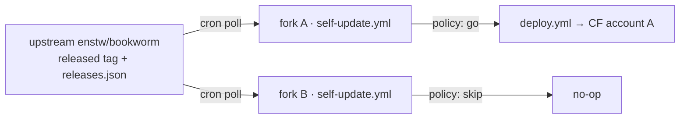

# Pull-mode updates — plan

Today one repo deploys one instance. `deploy.yml` fires `on: push` to
`main`, and the push *is* the decision: whatever lands is what ships, to
the single Cloudflare account whose token sits in that repo's secrets.
That is a 1:1 model, and it has no seat for a second instance.

The target is 1:N. One upstream repo, many self-hosted instances, and the
decision moves to the instance: each one asks upstream what shipped, and
decides for itself whether to take it or skip it. Upstream stops being the
thing that deploys and becomes the thing that publishes.

## The constraint everything else follows from

A Bookworm deploy is a **build**, not a file copy. `src/worker.js:8`
imports `../public/vendor/wasmtts/pack-manifest.mjs`; `public/vendor/` is
gitignored (`.gitignore:10`) and generated by `scripts/vendor.mjs` out of
`node_modules`. A bare `git pull` produces a tree that cannot bundle, let
alone deploy.

`scripts/deploy.sh` then does eight further account-level things around the
upload: `d1 create`, the `database_id` rewrite into `wrangler.jsonc`, `r2
bucket create`, applying `schema.sql` remotely, two idempotent `PRAGMA`-
guarded `ALTER TABLE` probes, stamping `BUILD` from `git rev-parse`,
`secret put`, and finally the smoke probe and `announce-build`.

So whatever pulls needs Node, pnpm, wrangler, git and network. That single
fact decides the shape.

## Shape: a scheduled workflow inside each fork

Each instance already is a fork with its own secrets and its own copy of
`deploy.yml`. The whole change is therefore a **trigger** change, not a
pipeline change: add a cron workflow that asks upstream what shipped,
applies the instance's own policy, and — only if the answer is yes — moves
the fork's `main` forward, at which point the existing `deploy.yml` runs
exactly as it does now.

Upstream already publishes the pointer this needs. `deploy.yml` moves the
`released` tag onto every commit that deployed green, and
`scripts/gen-release-notes.mjs` writes `public/releases.json`. An instance
polls `released` for *what*, and `releases.json` for *what changed* — no
new upstream publishing surface, no artifact registry, no signing keys.

### The two shapes rejected

**The Worker updates itself** through the Cloudflare API. Technically
possible — create an upload session with a file manifest, upload changed
files as base64 `multipart/form-data` against the one-hour JWT, `PUT` the
script with the completion token — but it requires upstream to publish a
prebuilt bundle (the vendor step above), reimplementing wrangler's
manifest, hashing and D1 migration inside a Worker, and an account-scoped
`Workers Scripts:Edit` token living *inside* the Worker, able to rewrite
the Worker. One leak becomes self-perpetuating account takeover. That
inverts the posture `deploy.yml` is built around: per-job permissions, a
credential-free `persist-credentials: false` checkout for the job that
executes pushed code, credentials only in the job that runs after a green
gate. There is also no test gate and no rollback on the instance side.

**An instance-side runner** on a VPS or a laptop works, and throws away the
property the install already advertises — that no machine needs a local
`.deploy.env`.

## Phases and tickets

Six phases, sequenced so that each one is independently useful and the
fleet is never half-migrated: phases 0–1 are things upstream should do
whether or not pull mode ships, phase 2 is the feature, and 3–5 make it
safe to leave alone.

Ticket ids are stable; `needs` is a hard ordering, not a preference.

### Phase 0 — stop the fork from diverging

**Exit criterion: a fork that has deployed is still a pure fast-forward of
upstream.** Nothing in phase 2 works until this holds — a fork that has
drifted by even one commit turns every update into a merge, and the merge
conflicts on the same lines every time. Two of the three tickets here are
defects today, independent of pull mode.

**PM-01 · the D1 `database_id` stops being committed**
- Touches: `scripts/deploy.sh:26-34`, `wrangler.jsonc`, `INSTALLATION.md`,
  `INSTALLATION.en.md:329`
- Why: the install docs tell the operator to commit the account-specific id
  that `deploy.sh` writes into `wrangler.jsonc`. That is one guaranteed
  divergent commit per fork, on exactly the line upstream edits whenever
  the D1 config changes. `deploy.sh` already resolves the id at deploy time
  from the account it is deploying to, so the committed copy buys nothing.
- Shape: make the rewrite ephemeral and revert it on exit — the same
  `trap 'git checkout -- …' EXIT` pattern the `BUILD` stamping already uses
  a few lines below it.
- Done when: a deploy on a fresh fork leaves `git status` clean, and
  `git merge upstream/main` reports a fast-forward.

**PM-02 · the release ledger becomes upstream-only**
- Touches: `.github/workflows/deploy.yml` (the *Record the release* step)
- Why: this is the one that makes PM-01 pointless on its own. Every fork
  deploy runs the ledger step, which commits `RELEASES.md`, opens a PR,
  and merges it — **re-diverging the fork on every single deploy**, forever.
  It also drags each instance through `scripts/wait-candidate-gate.mjs`,
  which is fail-closed on every path and waits on a `candidate-gate`
  required check that exists because of *upstream's* ruleset; a fork
  therefore either burns a second full gate run per deploy or turns a
  successful deploy into a red workflow. A fork has no release ledger to
  keep.
- Shape: guard the step on the repository being upstream. The ledger, the
  `released` tag move, and the PR dance all go behind it.
- Done when: a fork deploy ships the worker and touches no git ref;
  upstream's behaviour is byte-identical to today.
- Needs: nothing (can land before PM-01)

**PM-03 · the wasmtts asset sync becomes upstream-only**
- Touches: `.github/workflows/deploy.yml`, `scripts/sync-wasmtts-assets.mjs`
- Why: `WASMTTS_RELEASE` at `src/worker.js:581` is hard-coded to
  `enstw/bookworm`, so every instance's worker already fetches the model and
  ort binaries from *upstream's* release. A fork re-cutting its own
  `wasmtts-assets-v2` uploads tens of megabytes that nothing will ever read,
  needs `contents: write` to do it, and fails loudly when it cannot.
- Note the invariant this exposes, because phase 2 depends on it: upstream
  cuts the assets release *before* the worker that names the new file goes
  live, and instances only ever follow `released`, which moves after that.
  Fleet ordering is therefore already correct and must stay that way.
- Done when: a fork deploy skips the sync; a pin bump upstream still re-cuts
  the release before the worker that needs it ships.

### Phase 1 — upstream publishes a release worth following

**Exit criterion: an instance can answer "what should I be running, and may
I take it unattended?" from one API call.** Both tickets are about making
an existing, informal thing into a contract, because N instances will
depend on it without anyone watching.

**PM-04 · the `released` tag becomes a stated contract**
- Touches: `DESIGN.md` (*Delivery pipeline*), `scripts/test-deploy-policy.mjs`
- Why: `deploy.yml` already moves `released` onto every commit that deployed
  green, and that tag is the whole pointer pull mode reads. Today it is an
  implementation detail nobody promised to keep; the moment instances follow
  it, moving or removing it silently strands the fleet.
- Done when: the invariant is written down, and a test fails if the tag move
  leaves `deploy.yml`.

**PM-05 · a release can demand a human**
- Touches: `scripts/gen-release-notes.mjs`, `public/releases.json`
- Why: unattended updates need a way for upstream to say *stop*. A release
  that needs a new secret, an R2 setting, or a migration that is not
  backward-compatible must be able to force every instance into
  review-first mode regardless of its own policy. Without this, phase 2's
  auto mode is only safe as long as upstream never ships such a change,
  which is not a property anyone can promise.
- Done when: a marked release makes an auto-mode instance open a PR and
  stop instead of deploying.

### Phase 2 — the instance decides

**Exit criterion: a fork updates itself on a schedule, according to a policy
it owns, and skipping is a first-class outcome.**

**PM-06 · the instance policy file**
- Touches: new `instance.json` (name TBD), a validator script + its test
- Why: the decision has to live in the instance's own history, reviewable,
  not in a repo variable nobody can diff. Fields: channel
  (`released` / `pinned`), the pin, an optional minimum age so an instance
  can deliberately sit a day behind the fleet, and the auto-merge switch.
- **Blocked on the open question below** — the default value of the
  auto-merge switch is the one decision that changes what this ticket
  ships.
- Done when: an invalid policy fails the gate with a readable message
  rather than deploying something unintended.

**PM-07 · `.github/workflows/self-update.yml`**
- Touches: new workflow
- Why: this is the feature. `on: schedule` plus `workflow_dispatch`; resolve
  upstream's `released` through the API, compare against the fork's deployed
  commit, apply the policy, then either fast-forward `main` — letting the
  existing `deploy.yml` fire, unchanged — or open a PR and stop.
- Constraint carried from the existing split: the deciding job runs no code
  from the commit it is about to ship, and holds `contents: write` and
  nothing else.
- Needs: PM-01, PM-02, PM-06

**PM-08 · the policy gate covers the new workflow**
- Touches: `scripts/test-deploy-policy.mjs`
- Why: that file is the reason the permission split has stayed true, and it
  currently knows only `deploy.yml` and `candidate.yml` — a new workflow is
  simply invisible to it. It also has to satisfy the `environment:`
  assertions arriving on `hardening/m-risks`.
- Shape: a `checkSelfUpdatePolicy` beside the existing two, with its own
  seeded-mutation set — the file's own rule is that an assertion which can
  only pass is not a gate.
- Needs: PM-07, and `hardening/m-risks` landing first

**PM-09 · the schedule stays alive**
- Touches: `.github/workflows/self-update.yml`, `INSTALLATION*.md`
- Why: two GitHub behaviours, one merely annoying and one dangerous.
  Scheduled workflows are disabled by default in a fork — that is one more
  `gh workflow enable` beside the ones the install already runs. But in a
  public repo they are also auto-disabled after 60 days with no repository
  activity, which means an instance that legitimately skips every release
  for two months **stops checking silently**. That is the worst failure this
  design can have: it looks exactly like being up to date.
- Done when: an instance that has skipped for 60 days is still checking, or
  has told its operator it stopped.
- Needs: PM-07

### Phase 3 — safe to leave alone

**Exit criterion: a bad release is survivable by someone holding only a
phone.**

**PM-10 · settle the gate policy**
- Why: re-running the full suite per instance is 20 minutes with Chrome and
  ffmpeg per update, per instance — free on a public fork, billable on a
  private one. `released` only ever moves onto a commit that already passed
  that exact gate upstream, so the defensible default is to trust it and run
  a short smoke subset, with the full suite available to instances that want
  it.
- Done when: the default path deploys without re-running what upstream
  already ran, and the smoke subset actually fails on a broken worker.

**PM-11 · rollback without a laptop**
- Why: pull mode removes the human from the update, so it has to remove the
  human from the undo too. Pinning the policy to the previous `released` sha
  is the in-repo answer; `wrangler rollback` is the faster one. Pick one and
  document it as *the* answer.
- Needs: PM-06

**PM-12 · a failed self-update reaches the operator**
- Why: today a red deploy publishes a `test-failure-*` pre-release, which
  assumes someone is looking at the repo. An instance owner looks at their
  phone. GitHub's default scheduled-workflow-failure email may be enough —
  the ticket is to confirm it fires for this case and say so, or wire
  something that does.

### Phase 4 — install and docs

**Exit criterion: a fresh install is pull-mode by default and nobody is told
to run `gh repo sync` again.**

**PM-13 · the install flow sets the instance up to follow**
- Touches: `INSTALLATION.md` and `INSTALLATION.en.md` — the *Update
  Bookworm* section under Routine maintenance, plus the fork/enable steps
- Why: *Update Bookworm* currently reads `gh repo sync`, a manual pull the
  operator has to remember. It becomes the policy file plus the schedule.
- Needs: PM-07, PM-09

**PM-14 · DESIGN.md absorbs the decisions**
- Why: house rule — decisions worth keeping are distilled into the relevant
  subsystem section, and superseded rules are deleted rather than annotated.
  When this ships, the *Delivery pipeline* section gains pull mode, and both
  the Backlog entry and this document go away.

### Phase 5 — prove it

**PM-15 · a second instance, end to end**
- Why: every claim above is reasoning about a fleet of one. Stand up a
  throwaway second instance on a separate Cloudflare account, let it sit
  through a real upstream release, and confirm it took the update on its own
  schedule — and separately that a `pinned` instance beside it correctly
  did nothing.
- Done when: two instances, one updated and one deliberately skipped, from
  one upstream release nobody deployed by hand.

## Already satisfied

Unattended repeated migration across many instances is normally what blocks
this, and it is already done: `schema.sql` is `CREATE TABLE IF NOT EXISTS`
throughout, and every added column is backfilled behind its own `PRAGMA
table_info` probe in `deploy.sh`, so re-applying it is a no-op. The rule to
keep is that it stays that way — with N instances at N different versions,
a migration that is not idempotent and backward-compatible has no safe
moment to run.

`announce-build` needs nothing either: each instance announces its own
stamp against its own `announced_builds` row, so N instances ringing N
phone sets is the existing behaviour, N times.

## Open question

Pull mode makes upstream able to change every instance without anyone
reading the diff. The default policy is the decision: **auto-merge and
deploy**, or **open a PR and wait for the operator**, with pinning
available either way. Auto is right for the owner's own phone; PR is right
the moment someone else's reading depends on the instance. Undecided, and
it blocks PM-06 — every other ticket can start without it.
